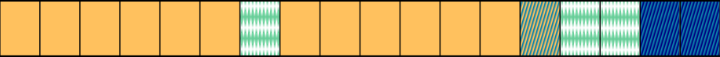

# Drafts

## Tests

::::: columns
::: {.column .fragment width="50%" style="text-align: center;"}
[Hypothèses générales]{.blue style="font-weight:bold;"}

[Définition]{style="font-weight:bold;"}\
Énoncés qui prédisent une relation entre deux variables en des termes généraux

[Formulation]{style="font-weight:bold;"}\
Supposent que X a un effet sur Y ou que X et Y sont liés

[Exemple]{style="font-weight:bold;"}\
"L’[âge]{.purple style="font-weight:bold;"} influence la [mémoire]{.gold style="font-weight:bold;"}."
:::

::: {.column .fragment width="50%" style="text-align: center;"}
[Hypothèses opérationnelles]{.blue style="font-weight:bold;"}

[Définition]{style="font-weight:bold;"}\
Traductions d’hypothèses générales avec les outils de mesure et d’expérimentation utilisés

[Formulation]{style="font-weight:bold;"}\
Utilisent ce qui est manipulé (modalités) et mesuré (indicateur/mesure exacte)

[Exemple]{style="font-weight:bold;"}\
"Le [score en tâche de rappel libre]{.gold style="font-weight:bold;"} est [différent]{.blue} (hypothèse bilatérale, deux directions) entre les [15-20 ans]{.purple style="font-weight:bold;"} et les [50-55 ans]{.purple style="font-weight:bold;"}."
:::
:::::

TD1 -\> make the timeline in svg format with inkscape then place text using absolute positioning Maybe change all placements/sizes of images to % instead of pixel values? I'm afraid it might look weird on some devices if I keep absolute values Add a follow-along version of the presentation (you can apparently do that with Quarto)

{.img-fluid .r-stretch fig-align="center" width="100%" fig-alt="Frise chronologique du premier semestre."}

## Attendus {.smaller}

### Rapport de synthèse (CC1)

#### Contenu

::: {.absolute right="0%" top="13.5%" style="color:#006DA3; font-size:18px;"}
50% de la note de l'UE
:::

::: {.absolute right="0%" top="17%" style="color:#006DA3; font-size:18px;"}
+20 points
:::

:::::: columns
::: {.column width="30%"}
\> [Introduction]{.red}
:::

::: {.column width="14%"}
:::

::: {.column width="56%"}
-   [Question de recherche et hypothèses]{.red}
-   [Arguments théoriques]{.red}
:::
::::::

:::::: columns
::: {.column width="24%"}
\> [Méthode]{.purple}
:::

::: {.column width="20%"}
3-5 pages\
par article
:::

::: {.column width="56%"}
-   [Participantes/participants]{.purple}
-   [Matériel]{.purple}
-   [Procédure]{.purple}
-   [Variables indépendantes et dépendantes]{.purple}
:::
::::::

:::::: columns
::: {.column width="30%"}
\> [Résultats]{.blue}
:::

::: {.column width="14%"}
:::

::: {.column width="56%"}
-   [Descriptifs incluant des données chiffrées]{.blue}
-   [Lecture d'un tableau et/ou d'un graphique]{.blue}
:::
::::::

:::::: columns
::: {.column width="30%"}
\> [Discussion-conclusion]{.teal}
:::

::: {.column width="14%"}
:::

::: {.column width="56%"}
-   [Synthèse/Discussion des hypothèses]{.teal}
-   [Thématiques de discussion]{.teal}
:::
::::::

## Attendus {.smaller}

### Rapport de synthèse (CC1)

#### Contenant et respect des consignes

::: {.absolute right="0%" top="17%" style="color:#006DA3; font-size:18px;"}
-20 points
:::

::::: columns
::: {.column width="35%"}
\> [Normes APA]{.red}
:::

::: {.column width="65%"}
-   [Tableaux et figures]{.red}
-   [Format de la référence de l'article lu aux normes]{.red}
:::
:::::

::::: columns
::: {.column width="35%"}
\> [Orthographe, grammaire, syntaxe et conjugaison]{.purple}
:::

::: {.column width="65%"}
-   [Points en moins toutes les 2 fautes dans une limite de 10 fautes]{.purple}
:::
:::::

::::: columns
::: {.column width="35%"}
\> [Respect des consignes]{.blue}
:::

::: {.column width="65%"}
-   [Qualité des autres synthèses d'articles]{.blue}
:::
:::::

## Attendus {.smaller .scrollable}

### Rapport de recherche (CC2)

#### Contenu

::: {.absolute right="0%" top="13.5%" style="color:#006DA3; font-size:18px;"}
50% de la note de l'UE
:::

::: {.absolute right="0%" top="17%" style="color:#006DA3; font-size:18px;"}
+20 points
:::

:::::: columns
::: {.column width="22%"}
\> [Page de garde]{.gold}
:::

::: {.column width="12%"}
[1 page]{.gold}
:::

::: {.column width="66%"}
-   [Choix d'un titre explicite, clair et synthétique]{.gold}
:::
::::::

:::::: columns
::: {.column width="22%"}
\> [Résumé]{.red}
:::

::: {.column width="12%"}
[250 mots max.]{.red}
:::

::: {.column width="66%"}
-   [Présentation des différents points du rapport : introduction, méthodologie, résultats, discussion-conclusion]{.red}
:::
::::::

:::::: columns
::: {.column width="22%"}
\> [Introduction]{.pink}
:::

::: {.column width="12%"}
[2-3 pages]{.pink}
:::

::: {.column width="66%"}
-   [Orientation vers la lectrice/le lecteur et articulation claire et correcte des paragraphes en entonnoir]{.pink}
-   [Présentation de la problématique dans un champ thématique défini]{.pink}
-   [Présentation de la question de recherche et de l’hypothèse générale en lien avec la problématique]{.pink}
-   [Utilisation d’au moins 3 des articles proposés durant les TD]{.pink}
-   [Utilisation d’autres références (articles scientifiques, chapitres d’ouvrages scientifiques…)]{.pink}
:::
::::::

:::::: columns
::: {.column width="22%"}
\> [Méthode]{.purple}
:::

::: {.column width="12%"}
[2-3 pages]{.purple}
:::

::: {.column width="66%"}
-   [Définition des participantes/participants]{.purple}
-   [Présentation du matériel/dispositif expérimental]{.purple}
-   [Présentation de la procédure]{.purple}
-   [Présentation et définition des variables indépendantes et dépendantes]{.purple}
-   [Présentation des hypothèses opérationnelles]{.purple}
:::
::::::

:::::: columns
::: {.column width="22%"}
\> [Résultats]{.dark-blue}
:::

::: {.column width="12%"}
[2-3 pages]{.dark-blue}
:::

::: {.column width="66%"}
-   [Analyse descriptive et/ou inférentielle des résultats]{.dark-blue}
-   [Représentation graphique et éventuellement tableau des résultats]{.dark-blue}
:::
::::::

:::::: columns
::: {.column width="22%"}
\> [Discussion-conclusion]{.blue}
:::

::: {.column width="12%"}
[2-3.5 pages]{.blue}
:::

::: {.column width="66%"}
-   [Présentation d’un résumé des résultats au regard de l’hypothèse posée et itérations avec la littérature]{.blue}
-   [Ouverture vers de nouvelles perspectives de recherche​]{.blue}
:::
::::::

:::::: columns
::: {.column width="22%"}
\> [Bibliography]{.teal}
:::

::: {.column width="12%"}
[-]{.teal}
:::

::: {.column width="66%"}
-   [Présentation des références citées dans le texte uniquement]{.teal}
:::
::::::

:::::: columns
::: {.column width="22%"}
\> [Annexes]{.green}
:::

::: {.column width="12%"}
[-]{.green}
:::

::: {.column width="66%"}
[-]{.green}
:::
::::::

## Attendus {.smaller .scrollable}

### Rapport de recherche (CC2)

#### Contenant et respect des consignes

::: {.absolute right="0%" top="17%" style="color:#006DA3; font-size:18px;"}
-20 points
:::

::::: columns
::: {.column width="40%"}
\> [Mise en forme générale APA]{.red}
:::

::: {.column width="60%"}
-   [Non respect des formats titres et sous-titres]{.red}
-   [Non respect des normes de présentation des références dans le texte]{.red}
-   [Non respect des normes de présentation des figures/tableaux]{.red}
:::
:::::

::::: columns
::: {.column width="40%"}
\> [Références bibliographiques APA]{.pink}
:::

::: {.column width="60%"}
-   [Non respect des normes de rédaction des références dans la partie bibliographique]{.pink}
:::
:::::

::::: columns
::: {.column width="40%"}
\> [Orthographe, grammaire, syntaxe et conjugaison]{.purple}
:::

::: {.column width="60%"}
-   [\< ou = à 5 fautes]{.purple}
-   [De 5 à 10 fautes]{.purple}
-   [\> 10 fautes]{.purple}
:::
:::::

::::: columns
::: {.column width="40%"}
\> [Cohérence]{.blue}
:::

::: {.column width="60%"}
-   [Cohérence interne du rapport entre ses parties non respectée]{.blue}
:::
:::::

::::: columns
::: {.column width="40%"}
\> [Respect des consignes de recueil des données]{.teal}
:::

::: {.column width="60%"}
-   [Nombre de participantes/participants défini en TD par étudiante/étudiant non respecté]{.teal}
:::
:::::