# Organisation

## Le mur des questions

::: r-stack
[padlet.com/elichaput/PY00302T](padlet.com/elichaput/PY00302T){style="font-size:20px;"}
:::

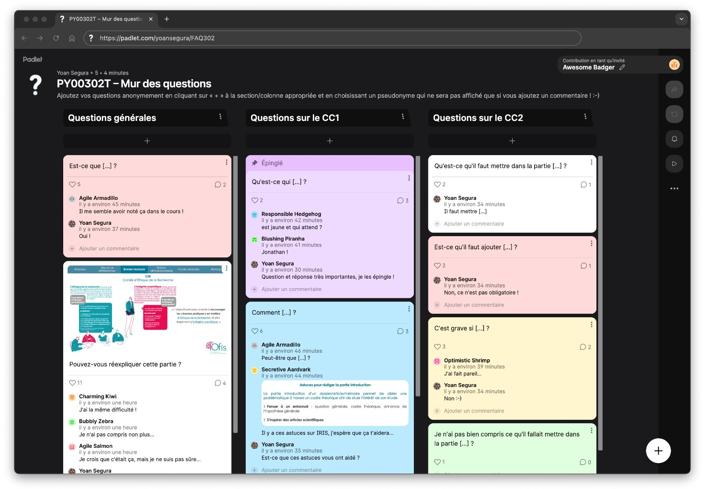{fig-align="center" width="75%" fig-alt="Un Padlet intitulé « mur des questions »"}

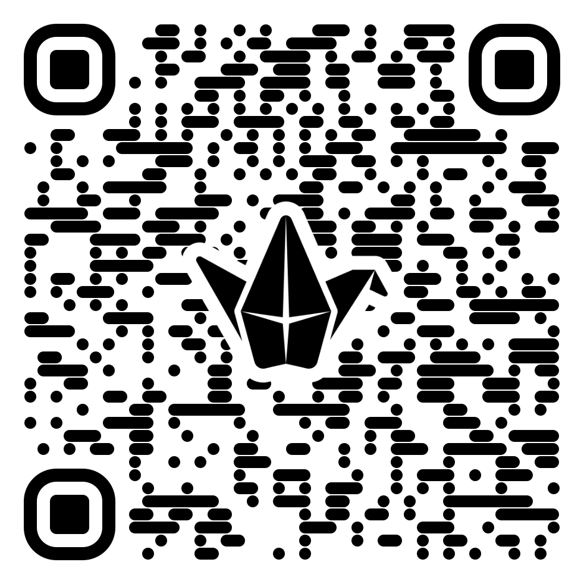{.absolute top="45%" right="-10%" width="15%" fig-alt="Un QR code renvoyant vers le même Padlet que le lien."}

## Calendrier

::: {.absolute left="6.5%" top="9%" style="color:#5D2AD5; font-size:20px; font-weight:bold;"}
TD1
:::

::: {.absolute left="5.5%" top="13%" style="color:#5D2AD5; font-size:20px;"}
25/09
:::

::: {.absolute left="7.7%" top="17%" style="color:#5D2AD5; font-size:20px; font-weight:bold;"}
\|
:::

::: {.absolute left="17.5%" top="9%" style="color:#0B3F93; font-size:20px; font-weight:bold;"}
TD2
:::

::: {.absolute left="17%" top="13%" style="color:#0B3F93; font-size:20px;"}
9/10
:::

::: {.absolute left="18.8%" top="17%" style="color:#0B3F93; font-size:20px; font-weight:bold;"}
\|
:::

::: {.absolute left="28.5%" top="9%" style="color:#005C5C; font-size:20px; font-weight:bold;"}
TD3
:::

::: {.absolute left="27.5%" top="13%" style="color:#005C5C; font-size:20px;"}
23/10
:::

::: {.absolute left="29.7%" top="17%" style="color:#005C5C; font-size:20px; font-weight:bold;"}
\|
:::

::: {.absolute left="35%" top="1.8%" style="font-size:13px; font-weight:bold;"}
Suspension pédagogique
:::

::: {.absolute left="35%" top="4.3%" style="font-size:13px;"}
Du 25 octobre au 1er novembre 2026
:::

::: {.absolute left="35.6%" top="7.8%" style="font-size:20px; font-weight:bold;"}
\|\
\|\
\|
:::

::: {.absolute left="45.5%" top="9%" style="color:#4B5700; font-size:20px; font-weight:bold;"}
TD4
:::

::: {.absolute left="44.5%" top="13%" style="color:#4B5700; font-size:20px;"}
13/11
:::

::: {.absolute left="46.7%" top="17%" style="color:#4B5700; font-size:20px; font-weight:bold;"}
\|
:::

::: {.absolute left="56.5%" top="9%" style="color:#6F4C06; font-size:20px; font-weight:bold;"}
TD5
:::

::: {.absolute left="55.5%" top="13%" style="color:#6F4C06; font-size:20px;"}
27/11
:::

::: {.absolute left="57.7%" top="17%" style="color:#6F4C06; font-size:20px; font-weight:bold;"}
\|
:::

::: {.absolute left="66.4%" top="13%" style="color:#A1213F; font-size:20px;"}
11/12
:::

::: {.absolute left="68.6%" top="17%" style="color:#A1213F; font-size:20px; font-weight:bold;"}
\|
:::

::: {.absolute left="77.5%" top="11.7%" style="font-size:13px; font-weight:bold;"}
Suspension pédagogique
:::

::: {.absolute right="-6.5%" top="14.2%" style="font-size:13px;"}
Du 20 décembre 2026 au 3 janvier 2027
:::

::: {.absolute left="82.7%" top="17%" style="font-size:20px; font-weight:bold;"}
\|
:::

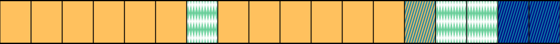{.absolute .r-stretch left="0%" top="22%" width="100%"}

::: {.absolute left="-0.5%" top="35%" style="font-size:20px; font-weight:bold;"}
\|
:::

::: {.absolute left="-6.5%" top="39%" style="font-size:13px; font-weight:bold;"}
Début des cours
:::

::: {.absolute left="-7.4%" top="41.5%" style="font-size:13px;"}
14 septembre 2026
:::

::: {.absolute left="7.7%" top="35%" style="color:#5D2AD5; font-size:20px; font-weight:bold;"}
\|\
\|\
\|
:::

::: {.absolute left="4%" top="48%" style="color:#5D2AD5; font-size:18px;"}
Attendus
:::

::: {.absolute left="-11.2%" top="51.5%" style="color:#5D2AD5; font-size:18px;"}
Démarche expérimentale
:::

::: {.absolute left="-4.7%" top="55%" style="color:#5D2AD5; font-size:18px;"}
Bonnes pratiques
:::

::: {.absolute left="-12.3%" top="58.5%" style="color:#5D2AD5; font-size:18px;"}
Rappels méthodologiques
:::

::: {.absolute left="-3.7%" top="62%" style="color:#5D2AD5; font-size:18px;"}
Cadre théorique
:::

::: {.absolute left="-8.1%" top="65.5%" style="color:#5D2AD5; font-size:18px;"}
Articles par groupe
:::

::: {.absolute left="18.8%" top="35%" style="color:#0B3F93; font-size:20px; font-weight:bold;"}
\|\
\|\
\|\
\|\
\|\
\|\
\|\
\|
:::

::: {.absolute left="11%" top="71.5%" style="color:#0B3F93; font-size:18px;"}
Intelligence artificielle
:::

::: {.absolute left="11%" top="75%" style="color:#0B3F93; font-size:18px;"}
Normes APA
:::

::: {.absolute left="11%" top="78.5%" style="color:#0B3F93; font-size:18px;"}
Base de données
:::

::: {.absolute left="11%" top="82%" style="color:#0B3F93; font-size:18px;"}
Partage des articles
:::

::: {.absolute left="11%" top="85.5%" style="color:#0B3F93; font-size:18px;"}
Problématique
:::

::: {.absolute left="11%" top="89%" style="color:#0B3F93; font-size:18px;"}
Expériences par groupe
:::

::: {.absolute left="29.7%" top="35%" style="color:#005C5C; font-size:20px; font-weight:bold;"}
\|
:::

::: {.absolute left="21%" top="39%" style="color:#005C5C; font-size:18px; font-weight:bold;"}
Travail à rendre (CC1)
:::

::: {.absolute left="21%" top="42.5%" style="color:#005C5C; font-size:18px;"}
Partage des expériences
:::

::: {.absolute left="21%" top="46%" style="color:#005C5C; font-size:18px;"}
Matériel
:::

::: {.absolute left="21%" top="49.5%" style="color:#005C5C; font-size:18px;"}
Méthodologie imposée
:::

::: {.absolute left="21%" top="53%" style="color:#005C5C; font-size:18px;"}
Matériel par groupe
:::

::: {.absolute left="21%" top="56.5%" style="color:#005C5C; font-size:18px;"}
Expériences par groupe
:::

::: {.absolute left="21%" top="60%" style="color:#005C5C; font-size:18px;"}
Pré-tests entre groupes
:::

::: {.absolute left="46.7%" top="35%" style="color:#4B5700; font-size:20px; font-weight:bold;"}
\|\
\|\
\|\
\|\
\|\
\|\
\|\
\|
:::

::: {.absolute left="43%" top="71.5%" style="color:#4B5700; font-size:18px;"}
Recueil des données normalement terminé
:::

::: {.absolute left="43%" top="75%" style="color:#4B5700; font-size:18px;"}
Rappels méthodologiques
:::

::: {.absolute left="43%" top="78.5%" style="color:#4B5700; font-size:18px;"}
Rappels statistiques
:::

::: {.absolute left="43%" top="82%" style="color:#4B5700; font-size:18px;"}
JAMOVI & Tableur
:::

::: {.absolute left="43%" top="85.5%" style="color:#4B5700; font-size:18px;"}
Statistiques par groupe
:::

::: {.absolute left="57.7%" top="35%" style="color:#6F4C06; font-size:20px; font-weight:bold;"}
\|\
\|\
\|
:::

::: {.absolute left="50%" top="48%" style="color:#6F4C06; font-size:18px;"}
Réflexions individuelles
:::

::: {.absolute left="50%" top="51.5%" style="color:#6F4C06; font-size:18px;"}
Réflexions par groupes
:::

::: {.absolute left="50%" top="55%" style="color:#6F4C06; font-size:18px;"}
Partage des réflexions
:::

::: {.absolute left="50%" top="58.5%" style="color:#6F4C06; font-size:18px;"}
(Auto-)évaluation sur l'UE
:::

::: {.absolute left="50%" top="62%" style="color:#6F4C06; font-size:18px;"}
Retours sur les travaux
:::

::: {.absolute left="68.6%" top="35%" style="color:#A1213F; font-size:20px; font-weight:bold;"}
\|
:::

::: {.absolute left="60%" top="39%" style="color:#A1213F; font-size:18px; font-weight:bold;"}
Travail à rendre (CC2)
:::

::: {.absolute left="93.8%" top="35%" style="font-size:20px; font-weight:bold;"}
\|\
\|
:::

::: {.absolute right="-2.5%" top="44%" style="font-size:13px; font-weight:bold;"}
Période des examens
:::

::: {.absolute right="-4%" top="46.5%" style="font-size:13px;"}
Du 4 au 18 janvier 2027
:::

## Calendrier

::: {.absolute left="6.5%" top="9%" style="color:#5D2AD5; font-size:20px; font-weight:bold;"}
TD1
:::

::: {.absolute left="5.5%" top="13%" style="color:#5D2AD5; font-size:20px;"}
25/09
:::

::: {.absolute left="7.7%" top="17%" style="color:#5D2AD5; font-size:20px; font-weight:bold;"}
\|
:::

::: {.absolute left="17.5%" top="9%" style="color:#0B3F93; font-size:20px; font-weight:bold;"}
TD2
:::

::: {.absolute left="17%" top="13%" style="color:#0B3F93; font-size:20px;"}
9/10
:::

::: {.absolute left="18.8%" top="17%" style="color:#0B3F93; font-size:20px; font-weight:bold;"}
\|
:::

::: {.absolute left="28.5%" top="9%" style="color:#005C5C; font-size:20px; font-weight:bold;"}
TD3
:::

::: {.absolute left="27.5%" top="13%" style="color:#005C5C; font-size:20px;"}
23/10
:::

::: {.absolute left="29.7%" top="17%" style="color:#005C5C; font-size:20px; font-weight:bold;"}
\|
:::

::: {.absolute left="35%" top="1.8%" style="font-size:13px; font-weight:bold;"}
Suspension pédagogique
:::

::: {.absolute left="35%" top="4.3%" style="font-size:13px;"}
Du 25 octobre au 1er novembre 2026
:::

::: {.absolute left="35.6%" top="7.8%" style="font-size:20px; font-weight:bold;"}
\|\
\|\
\|
:::

::: {.absolute left="45.5%" top="9%" style="color:#4B5700; font-size:20px; font-weight:bold;"}
TD4
:::

::: {.absolute left="44.5%" top="13%" style="color:#4B5700; font-size:20px;"}
13/11
:::

::: {.absolute left="46.7%" top="17%" style="color:#4B5700; font-size:20px; font-weight:bold;"}
\|
:::

::: {.absolute left="56.5%" top="9%" style="color:#6F4C06; font-size:20px; font-weight:bold;"}
TD5
:::

::: {.absolute left="55.5%" top="13%" style="color:#6F4C06; font-size:20px;"}
27/11
:::

::: {.absolute left="57.7%" top="17%" style="color:#6F4C06; font-size:20px; font-weight:bold;"}
\|
:::

::: {.absolute left="66.4%" top="13%" style="color:#A1213F; font-size:20px;"}
11/12
:::

::: {.absolute left="68.6%" top="17%" style="color:#A1213F; font-size:20px; font-weight:bold;"}
\|
:::

::: {.absolute left="77.5%" top="11.7%" style="font-size:13px; font-weight:bold;"}
Suspension pédagogique
:::

::: {.absolute right="-6.5%" top="14.2%" style="font-size:13px;"}
Du 20 décembre 2026 au 3 janvier 2027
:::

::: {.absolute left="82.7%" top="17%" style="font-size:20px; font-weight:bold;"}
\|
:::

{.absolute .r-stretch left="0%" top="22%" width="100%" fig-alt="Frise chronologique du premier semestre, indiquant six semaines de cours suivies d'une semaine de suspension pédagogique, six autres semaines de cours, une semaine intermédiaire dédiée aux rattrapages éventuels de cours, puis deux semaines de suspension pédagogique et deux semaines d'examens."}

::: {.absolute left="-0.5%" top="35%" style="font-size:20px; font-weight:bold;"}
\|
:::

::: {.absolute left="-6.5%" top="39%" style="font-size:13px; font-weight:bold;"}
Début des cours
:::

::: {.absolute left="-7.4%" top="41.5%" style="font-size:13px;"}
14 septembre 2026
:::

::: {.absolute left="29.7%" top="35%" style="color:#005C5C; font-size:20px; font-weight:bold;"}
\|
:::

::: {.absolute left="21%" top="39%" style="color:#005C5C; font-size:18px; font-weight:bold;"}
Travail à rendre (CC1)
:::

::: {.absolute left="21%" top="42.5%" style="color:#005C5C; font-size:18px;"}
"Rapport de synthèses"
:::

::: {.absolute left="25.5%" top="49.5%" style="color:#005C5C; font-size:18px;  font-weight:bold;"}
Objectifs
:::

::: {.absolute left="5.5%" top="53%" style="color:#005C5C; font-size:18px;"}
Synthétiser et résumer des articles scientifiques
:::

::: {.absolute left="4.5%" top="56.5%" style="color:#005C5C; font-size:18px;"}
Analyser et comprendre le cadre théorique autour de
:::

::: {.absolute left="3.3%" top="60%" style="color:#005C5C; font-size:18px;"}
l'expérience à effectuer pour le rapport de recherche
:::

::: {.absolute left="68.6%" top="35%" style="color:#A1213F; font-size:20px; font-weight:bold;"}
\|\
\|\
\|\
\|\
\|\
\|\
\|
:::

::: {.absolute left="59%" top="67%" style="color:#A1213F; font-size:18px; font-weight:bold;"}
Travail à rendre (CC2)
:::

::: {.absolute left="59%" top="70.5%" style="color:#A1213F; font-size:18px;"}
"Rapport de recherche"
:::

::: {.absolute left="65%" top="77.5%" style="color:#A1213F; font-size:18px; font-weight:bold;"}
Objectifs
:::

::: {.absolute right="-5%" top="81%" style="color:#A1213F; font-size:18px;"}
Apprendre à construire une étude expérimentale en psychologie
:::

::: {.absolute right="6.2%" top="84.5%" style="color:#A1213F; font-size:18px;"}
Se former à la recherche par la recherche
:::

::: {.absolute left="93.8%" top="35%" style="font-size:20px; font-weight:bold;"}
\|\
\|
:::

::: {.absolute right="-2.5%" top="44%" style="font-size:13px; font-weight:bold;"}
Période des examens
:::

::: {.absolute right="-4%" top="46.5%" style="font-size:13px;"}
Du 4 au 18 janvier 2027
:::

## Objectifs par séance

::: {.absolute left="10.5%" top="24%" style="color:#5B748F; font-size:18px; font-weight:bold;"}
Pour la séance 2
:::

::: {.absolute left="-10%" top="28%" style="color:#5B748F; font-size:18px;"}
Lire les articles à l'aide (ou non) de la fiche de
:::

::: {.absolute left="-7%" top="32%" style="color:#5B748F; font-size:18px;"}
lecture et avancer sur le [rapport de synthèses]{.light-blue}
:::

::: {.absolute left="19.5%" top="36%" style="color:#5B748F; font-size:20px; font-weight:bold;"}
\|
:::

::: {.absolute left="48%" top="5%" style="color:#5B748F; font-size:18px; font-weight:bold;"}
Pour la séance 4
:::

::: {.absolute left="34%" top="9%" style="color:#5B748F; font-size:18px;"}
Avancer sur le [rapport de recherche]{.light-blue} ([partie]{.light-blue}
:::

::: {.absolute left="34%" top="13%" style="color:#5B748F; font-size:18px;"}
[méthode]{.light-blue}) et terminer le recueil des données
:::

::: {.absolute left="59.5%" top="17.7%" style="color:#5B748F; font-size:20px; font-weight:bold;"}
\|\
\|\
\|\
\|\
\|
:::

::: {.absolute right="-6%" top="20%" style="color:#5B748F; font-size:18px; font-weight:bold;"}
Pour la semaine suivante
:::

::: {.absolute right="-16%" top="24%" style="color:#5B748F; font-size:18px;"}
Terminer le [rapport de recherche]{.light-blue} ([parties]{.light-blue}
:::

::: {.absolute right="-14%" top="28%" style="color:#5B748F; font-size:18px;"}
[discussion-conclusion]{.light-blue}, [bibliographie]{.light-blue},
:::

::: {.absolute right="-13.3%" top="32%" style="color:#5B748F; font-size:18px;"}
[résumé]{.light-blue}, [table des matières]{.light-blue}, [annexes]{.light-blue})
:::

::: {.absolute left="99%" top="36%" style="color:#5B748F; font-size:20px; font-weight:bold;"}
\|
:::

{.absolute .r-stretch left="0%" top="40%" width="100%" fig-alt="Une barre de progression remplie à 10%, avant le travail requit pour la séance 2."}

::: {.absolute left="39.5%" top="62.5%" style="color:#5B748F; font-size:20px; font-weight:bold;"}
\|
:::

::: {.absolute left="24.8%" top="66.5%" style="color:#5B748F; font-size:18px; font-weight:bold;"}
Pour la séance 3
:::

::: {.absolute left="8%" top="70.5%" style="color:#5B748F; font-size:18px;"}
Terminer le [rapport de synthèses]{.light-blue} et avancer sur
:::

::: {.absolute left="11.2%" top="74.5%" style="color:#5B748F; font-size:18px;"}
le [rapport de recherche]{.light-blue} ([mise en forme du]{.light-blue}
:::

::: {.absolute left="9.1%" top="78.5%" style="color:#5B748F; font-size:18px;"}
[document]{.light-blue}, [page de garde]{.light-blue}, [partie introduction]{.light-blue})
:::

::: {.absolute left="9.1%" top="82.5%" style="color:#5B748F; font-size:18px;"}
et l'expérience (apporter le matériel en plus
:::

::: {.absolute left="11.8%" top="86.5%" style="color:#5B748F; font-size:18px;"}
nécessaire pour construire l'expérience)
:::

::: {.absolute left="79.3%" top="62.5%" style="color:#5B748F; font-size:20px; font-weight:bold;"}
\|
:::

::: {.absolute left="78%" top="66.5%" style="color:#5B748F; font-size:18px; font-weight:bold;"}
Pour la séance 5
:::

::: {.absolute right="-5%" top="70.5%" style="color:#5B748F; font-size:18px;"}
Avancer sur le [rapport de recherche]{.light-blue}
:::

::: {.absolute left="77%" top="74.5%" style="color:#5B748F; font-size:18px;"}
(partie [résultats]{.light-blue})
:::

# Attendus

## Rapport de synthèse (CC1) {.smaller}

::::::::::::::::::::::::::::::: panel-tabset
### Contenu

::: {.absolute right="0%" top="7%" style="color:#006DA3; font-size:18px;"}
50% de la note de l'UE
:::

::: {.absolute right="0%" top="10.5%" style="color:#006DA3; font-size:18px;"}
+20 points
:::

:::::: columns
::: {.column width="30%"}
\> [Introduction]{.red}
:::

::: {.column width="14%"}
:::

::: {.column width="56%"}
-   [Question de recherche et hypothèses]{.red}
-   [Arguments théoriques]{.red}
:::
::::::

:::::: columns
::: {.column width="24%"}
\> [Méthode]{.purple}
:::

::: {.column width="20%"}
3-5 pages\
par article
:::

::: {.column width="56%"}
-   [Participantes/participants]{.purple}
-   [Matériel]{.purple}
-   [Procédure]{.purple}
-   [Variables indépendantes et dépendantes]{.purple}
:::
::::::

:::::: columns
::: {.column width="30%"}
\> [Résultats]{.blue}
:::

::: {.column width="14%"}
:::

::: {.column width="56%"}
-   [Descriptifs incluant des données chiffrées]{.blue}
-   [Lecture d'un tableau et/ou d'un graphique]{.blue}
:::
::::::

:::::: columns
::: {.column width="30%"}
\> [Discussion-conclusion]{.teal}
:::

::: {.column width="14%"}
:::

::: {.column width="56%"}
-   [Synthèse/Discussion des hypothèses]{.teal}
-   [Thématiques de discussion]{.teal}
:::
::::::

### Contenant et respect des consignes

::: {.absolute right="0%" top="10.5%" style="color:#006DA3; font-size:18px;"}
-20 points
:::

::::: columns
::: {.column width="35%"}
\> [Normes APA]{.red}
:::

::: {.column width="65%"}
-   [Tableaux et figures]{.red}
-   [Format de la référence de l'article lu aux normes]{.red}
:::
:::::

::::: columns
::: {.column width="35%"}
\> [Orthographe, grammaire, syntaxe et conjugaison]{.purple}
:::

::: {.column width="65%"}
-   [Points en moins toutes les 2 fautes dans une limite de 10 fautes]{.purple}
:::
:::::

::::: columns
::: {.column width="35%"}
\> [Respect des consignes]{.blue}
:::

::: {.column width="65%"}
-   [Qualité des autres synthèses d'articles]{.blue}
:::
:::::
:::::::::::::::::::::::::::::::

## Rapport de recherche (CC2) {.smaller .scrollable}

::::::::::::::::::::::::::::::::::::::::::::::::::::: panel-tabset
### Contenu

::: {.absolute right="0%" top="7%" style="color:#006DA3; font-size:18px;"}
50% de la note de l'UE
:::

::: {.absolute right="0%" top="10.5%" style="color:#006DA3; font-size:18px;"}
+20 points
:::

:::::: columns
::: {.column width="22%"}
\> [Page de garde]{.gold}
:::

::: {.column width="12%"}
[1 page]{.gold}
:::

::: {.column width="66%"}
-   [Choix d'un titre explicite, clair et synthétique]{.gold}
:::
::::::

:::::: columns
::: {.column width="22%"}
\> [Résumé]{.red}
:::

::: {.column width="12%"}
[250 mots max.]{.red}
:::

::: {.column width="66%"}
-   [Présentation des différents points du rapport : introduction, méthodologie, résultats, discussion-conclusion]{.red}
:::
::::::

:::::: columns
::: {.column width="22%"}
\> [Introduction]{.pink}
:::

::: {.column width="12%"}
[2-3 pages]{.pink}
:::

::: {.column width="66%"}
-   [Orientation vers la lectrice/le lecteur et articulation claire et correcte des paragraphes en entonnoir]{.pink}
-   [Présentation de la problématique dans un champ thématique défini]{.pink}
-   [Présentation de la question de recherche et de l’hypothèse générale en lien avec la problématique]{.pink}
-   [Utilisation d’au moins 3 des articles proposés durant les TD]{.pink}
-   [Utilisation d’autres références (articles scientifiques, chapitres d’ouvrages scientifiques…)]{.pink}
:::
::::::

:::::: columns
::: {.column width="22%"}
\> [Méthode]{.purple}
:::

::: {.column width="12%"}
[2-3 pages]{.purple}
:::

::: {.column width="66%"}
-   [Définition des participantes/participants]{.purple}
-   [Présentation du matériel/dispositif expérimental]{.purple}
-   [Présentation de la procédure]{.purple}
-   [Présentation et définition des variables indépendantes et dépendantes]{.purple}
-   [Présentation des hypothèses opérationnelles]{.purple}
:::
::::::

:::::: columns
::: {.column width="22%"}
\> [Résultats]{.dark-blue}
:::

::: {.column width="12%"}
[2-3 pages]{.dark-blue}
:::

::: {.column width="66%"}
-   [Analyse descriptive et/ou inférentielle des résultats]{.dark-blue}
-   [Représentation graphique et éventuellement tableau des résultats]{.dark-blue}
:::
::::::

:::::: columns
::: {.column width="22%"}
\> [Discussion-conclusion]{.blue}
:::

::: {.column width="12%"}
[2-3.5 pages]{.blue}
:::

::: {.column width="66%"}
-   [Présentation d’un résumé des résultats au regard de l’hypothèse posée et itérations avec la littérature]{.blue}
-   [Ouverture vers de nouvelles perspectives de recherche​]{.blue}
:::
::::::

:::::: columns
::: {.column width="22%"}
\> [Bibliography]{.teal}
:::

::: {.column width="12%"}
[-]{.teal}
:::

::: {.column width="66%"}
-   [Présentation des références citées dans le texte uniquement]{.teal}
:::
::::::

:::::: columns
::: {.column width="22%"}
\> [Annexes]{.green}
:::

::: {.column width="12%"}
[-]{.green}
:::

::: {.column width="66%"}
[-]{.green}
:::
::::::

### Contenant et respect des consignes

::: {.absolute right="0%" top="10.5%" style="color:#006DA3; font-size:18px;"}
-20 points
:::

::::: columns
::: {.column width="40%"}
\> [Mise en forme générale APA]{.red}
:::

::: {.column width="60%"}
-   [Non respect des formats titres et sous-titres]{.red}
-   [Non respect des normes de présentation des références dans le texte]{.red}
-   [Non respect des normes de présentation des figures/tableaux]{.red}
:::
:::::

::::: columns
::: {.column width="40%"}
\> [Références bibliographiques APA]{.pink}
:::

::: {.column width="60%"}
-   [Non respect des normes de rédaction des références dans la partie bibliographique]{.pink}
:::
:::::

::::: columns
::: {.column width="40%"}
\> [Orthographe, grammaire, syntaxe et conjugaison]{.purple}
:::

::: {.column width="60%"}
-   [\< ou = à 5 fautes]{.purple}
-   [De 5 à 10 fautes]{.purple}
-   [\> 10 fautes]{.purple}
:::
:::::

::::: columns
::: {.column width="40%"}
\> [Cohérence]{.blue}
:::

::: {.column width="60%"}
-   [Cohérence interne du rapport entre ses parties non respectée]{.blue}
:::
:::::

::::: columns
::: {.column width="40%"}
\> [Respect des consignes de recueil des données]{.teal}
:::

::: {.column width="60%"}
-   [Nombre de participantes/participants défini en TD par étudiante/étudiant non respecté]{.teal}
:::
:::::
:::::::::::::::::::::::::::::::::::::::::::::::::::::

# Démarche expérimentale

## Schématisation

Refaire et insérer figure Yoan

## Exemples de types d'articles courants

::::::: columns
::: {.column .fragment width="25%" style="text-align: center; font-size:20px"}
[Article de recherche]{.blue style="font-weight:bold; text-align: center"}

"Son objectif est d’énoncer une [avancée scientifique]{style="font-weight:bold;"} dans un domaine de recherche précis. Il vise donc l’[originalité]{style="font-weight:bold;"} et la [nouveauté à travers les résultats]{style="font-weight:bold;"} qu’il transmet."
:::

::: {.column .fragment width="25%" style="text-align: center; font-size:20px"}
[Revue de littérature]{.blue style="font-weight:bold"}

"[État de l’art]{style="font-weight:bold;"}, c’est-à-dire une mise au point dans un domaine particulier. Il réalise un [bilan sur les recherches et connaissances déjà acquises]{style="font-weight:bold;"}. Il ne [propose pas de nouvelles avancées, mais peut proposer de nouvelles pistes]{style="font-weight:bold;"}."
:::

::: {.column .fragment width="25%" style="text-align: center; font-size:20px"}
[Revue systématique]{.blue style="font-weight:bold"}

"Elle doit [analyser et synthétiser plusieurs données]{style="font-weight:bold;"} scientifiques. Elle propose [une vue d’ensemble de plusieurs résultats d’études]{style="font-weight:bold;"} scientifiques [répondant à une même question]{style="font-weight:bold;"}."
:::

::: {.column .fragment width="25%" style="text-align: center; font-size:20px"}
[Méta-analyse]{.blue style="font-weight:bold"}

"Similaire à la revue systématique. Elle propose une [analyse statistique qui combine les données de nombreux articles et publications]{style="font-weight:bold;"}. Permet une [vision globale]{style="font-weight:bold;"} à propos d’une thématique, expérience ou question."
:::
:::::::

::: aside
[https://www.scribbr.fr/article-scientifique/types-articles-scientifiques/](https://www.scribbr.fr/article-scientifique/types-articles-scientifiques/){style="font-size:15px"}
:::

## Fiabilité d'une étude scientifique

{.absolute left="-2%" top="15%" width="20%" fig-alt="Première case d'un comic strip. Deux femmes sont assises sur un canapé. L'une d'elles lit un journal si grand qu'il bloque la vue de l'autre femme, qui joue à un jeu vidéo avec une manette.  Sur le journal, on peut lire le titre du comic : Comment savoir si une étude est fiable ?"} 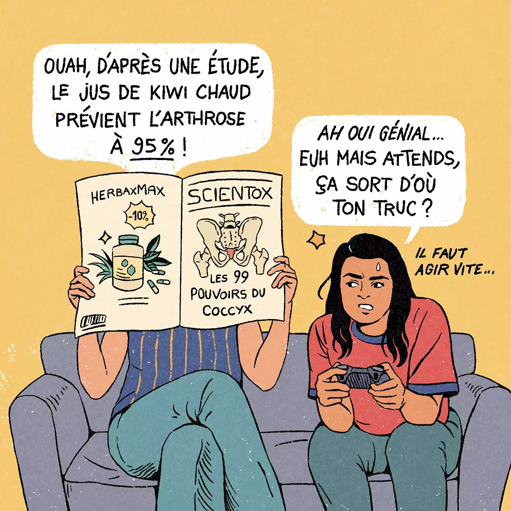{.absolute left="19%" top="15%" width="20%" fig-alt="Deuxième case du comic strip. "} 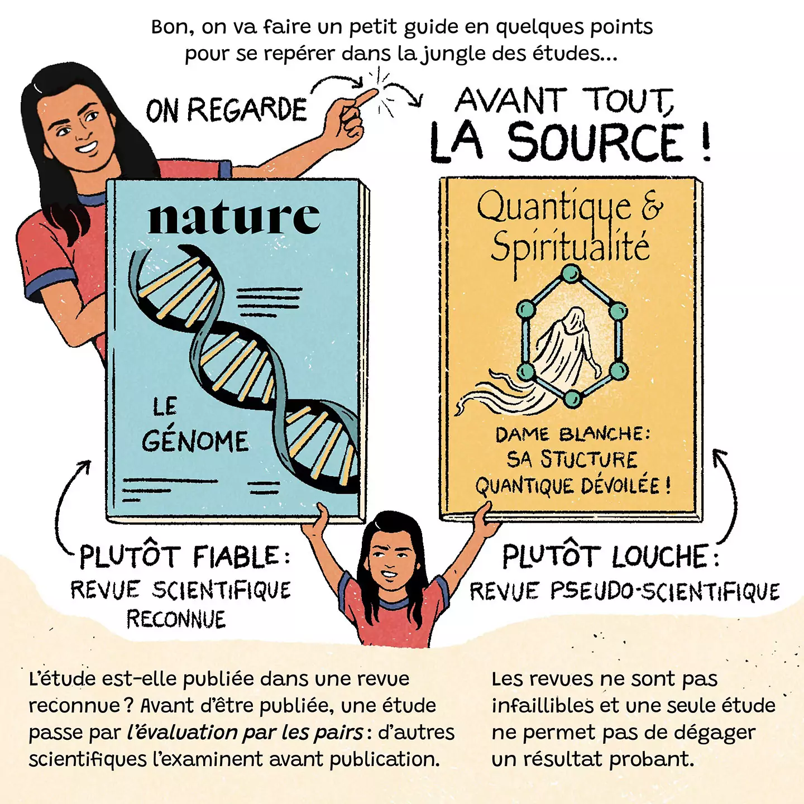{.absolute left="40%" top="15%" width="20%" fig-alt="Troisième case du comic strip. "} 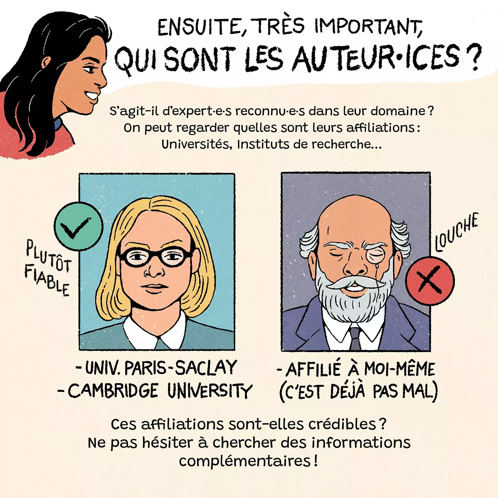{.absolute left="61%" top="15%" width="20%" fig-alt="Quatrième case du comic strip. "} 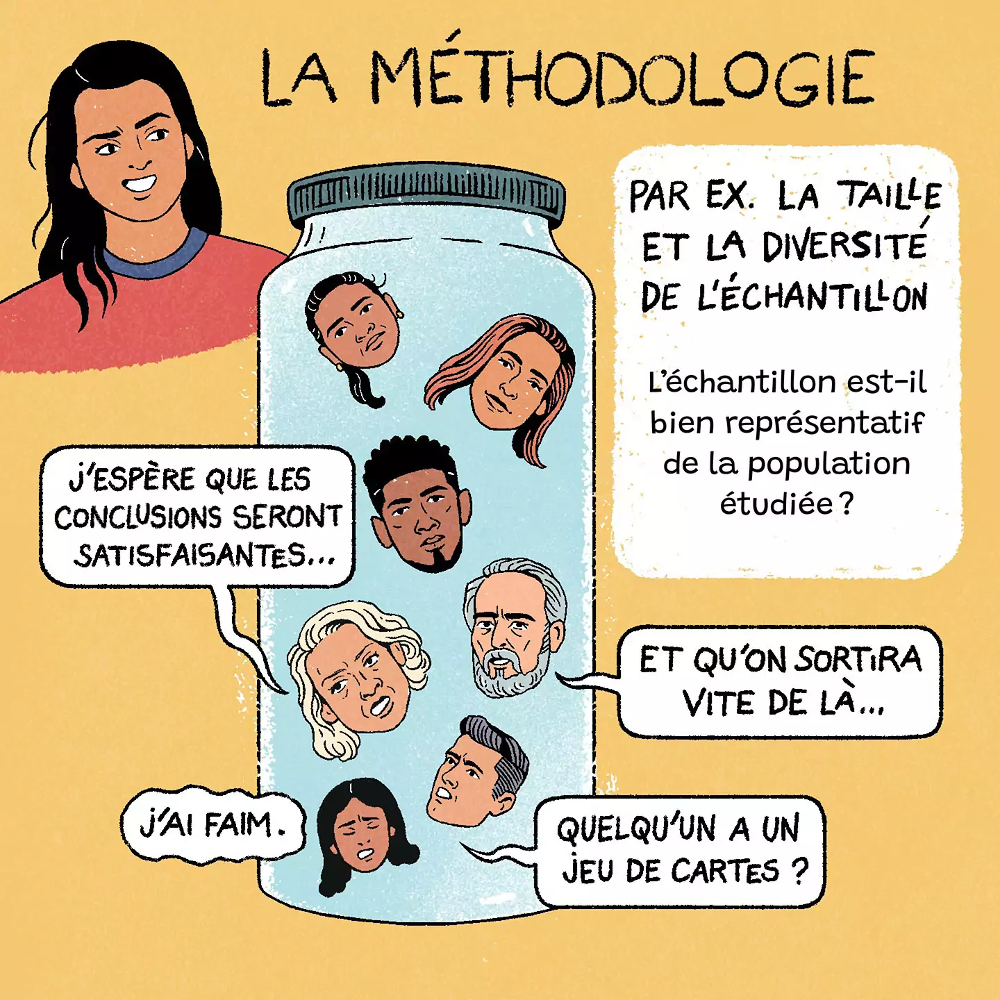{.absolute right="-2%" top="15%" width="20%" fig-alt="Cinquième case du comic strip. "}

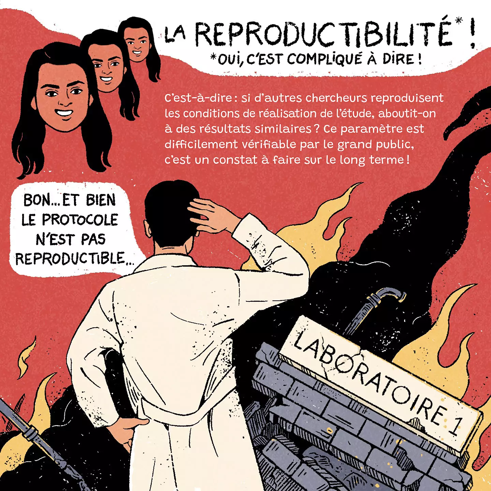{.absolute left="-2%" top="50%" width="20%" fig-alt="Sixième case du comic strip. "}

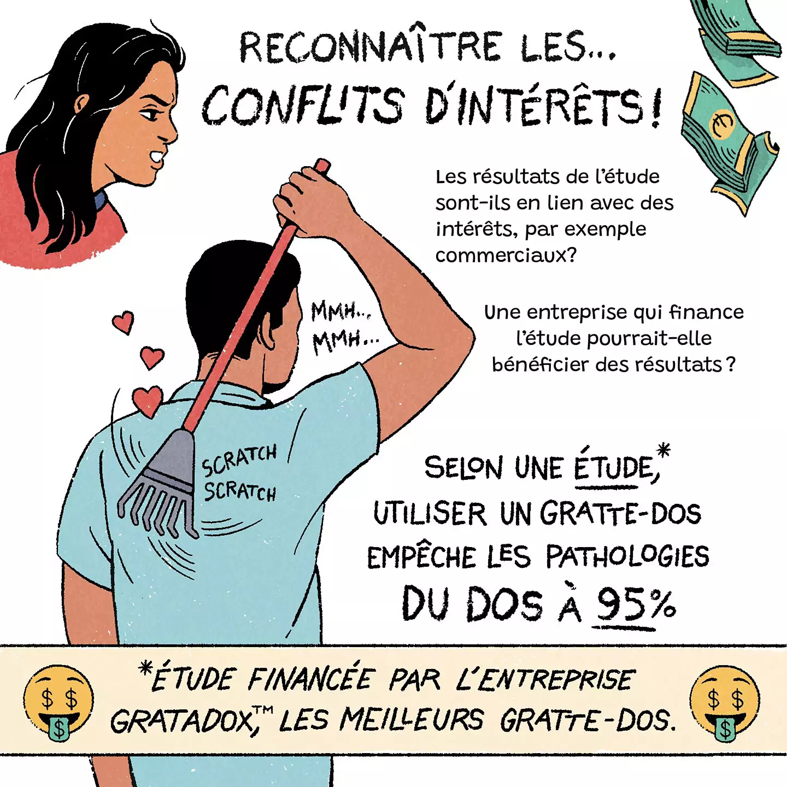{.absolute left="19%" top="50%" width="20%" fig-alt="Septième case du comic strip. "} 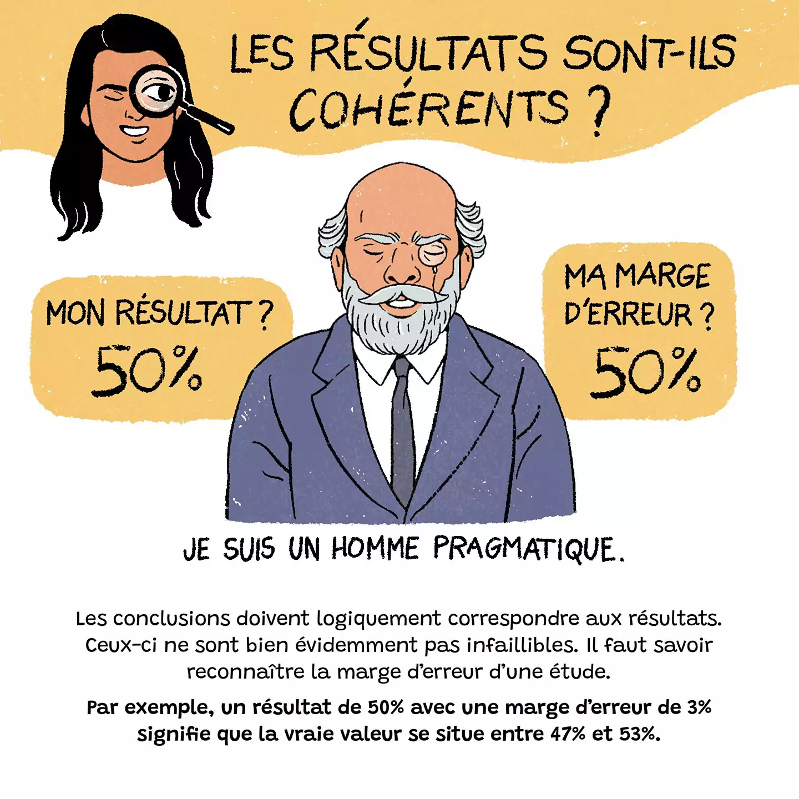{.absolute left="40%" top="50%" width="20%" fig-alt="Huitième case du comic strip. "}

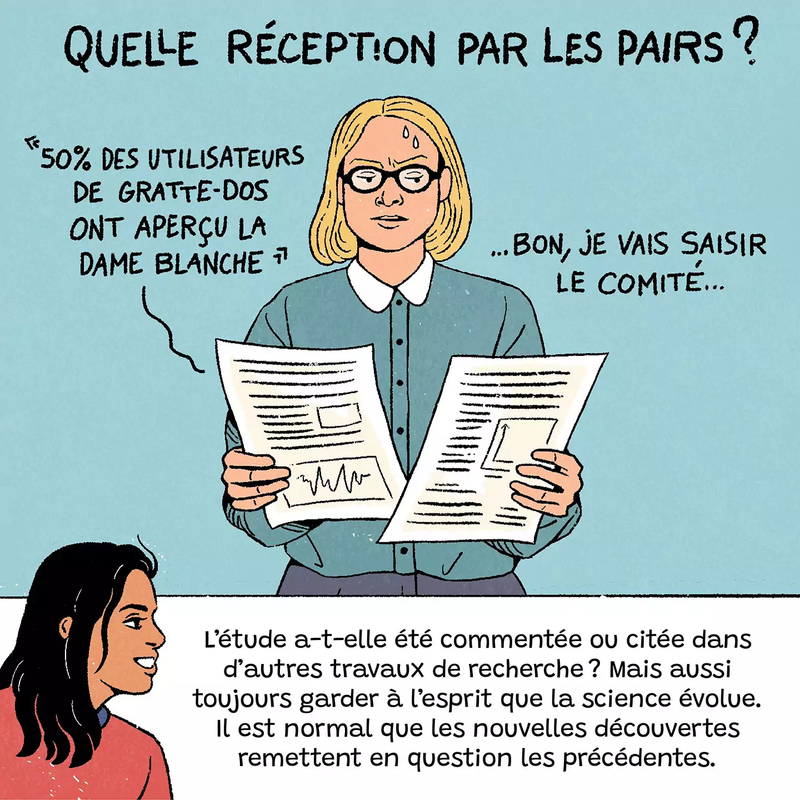{.absolute left="61%" top="50%" width="20%" fig-alt="Neuvième case du comic strip. "} 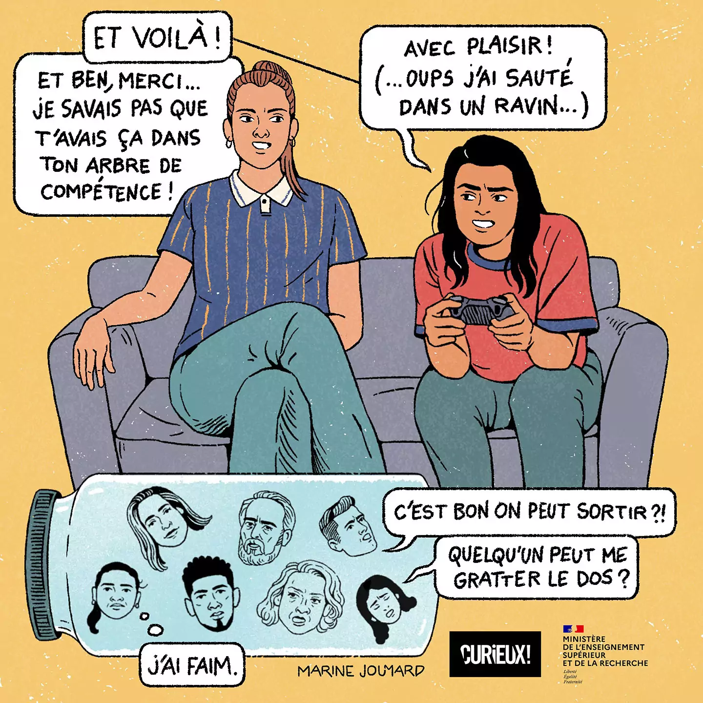{.absolute right="-2%" top="50%" width="20%" fig-alt="Dixième et dernière case du comic strip. "}

::: aside
[https://www.curieux.live/2025/01/22/bd-comment-savoir-si-une-etude-est-fiable/](https://www.curieux.live/2025/01/22/bd-comment-savoir-si-une-etude-est-fiable/){style="font-size:15px"}
:::

# Bonnes pratiques

## CER {.smaller style="text-align: center"}

### Comité d'Ethique de la recherche

:::::: columns
::: {.column width="32%"}
"Instance permettant de [garantir la]{style="font-weight:bold;"} [déontologie]{.highlighted-light} [des protocoles de recherche]{style="font-weight:bold;"} impliquant la personne humaine."

[Il existe d’autres CER que celui de Toulouse (p. ex. Aix-Marseille, Lille, Paris)]{style="font-weight:lighter;"}
:::

::: {.column width="36%"}
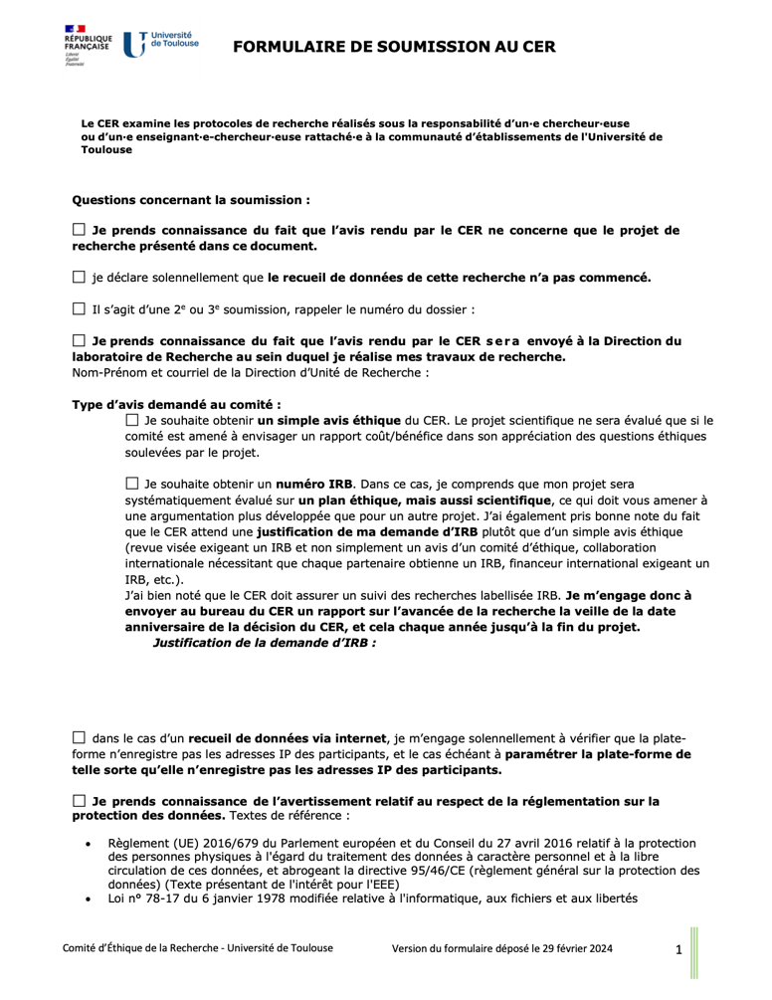{fig-alt="Une capture d'écran des missions de l'IRB."}
:::

::: {.column width="32%"}
"Statut Institutional Review Board ([IRB]{.highlighted-light}) qui permet [l’éligibilité à des projets internationaux]{style="font-weight:bold;"} et la [publication dans des revues scientifiques qui l’exigent]{style="font-weight:bold;"}"
:::
::::::

::: aside
[https://www.univ-toulouse.fr/actualites/comite-d-ethique-de-recherche-cer](https://www.univ-toulouse.fr/actualites/comite-d-ethique-de-recherche-cer){style="font-size:15px"}
:::

## CER {.smaller style="text-align: center"}

### Comité d'Ethique de la recherche

:::::: columns
::: {.column width="32%"}
"Le projet a été élaboré [à partir de la demande de chercheuses/chercheurs de plusieurs établissements du site \[toulousain\]]{style="font-weight:bold;"}, ce qui a conduit à la constitution d’un [groupe de travail inter-établissements]{style="font-weight:bold;"}."
:::

::: {.column width="36%"}
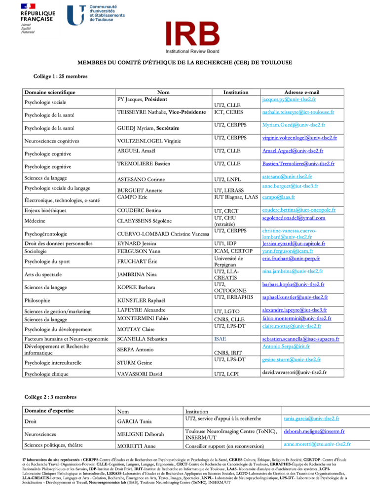{fig-alt="Une capture d'écran des missions de l'IRB."}
:::

::: {.column width="32%"}
"L’objectif principal consiste à [encourager les « bonnes pratiques » en matière]{style="font-weight:bold;"} [d’éthique de la recherche](https://www.ofis-france.fr/espaces-thematiques/integrite-scientifique-ethique-de-la-recherche-deontologie/#:~:text=L'int%C3%A9grit%C3%A9%20scientifique%20est%20d%C3%A9sormais,le%20caract%C3%A8re%20honn%C3%AAte%20et%20rigoureux.), et plus largement [d’intégrité scientifique](https://www.ofis-france.fr/espaces-thematiques/integrite-scientifique-ethique-de-la-recherche-deontologie/#:~:text=L'int%C3%A9grit%C3%A9%20scientifique%20est%20d%C3%A9sormais,le%20caract%C3%A8re%20honn%C3%AAte%20et%20rigoureux.)."
:::
::::::

::: aside
[https://www.univ-toulouse.fr/recherche-dynamique/ethique-et-integrite-scientifique](https://www.univ-toulouse.fr/recherche-dynamique/ethique-et-integrite-scientifique){style="font-size:15px"}
:::

## CER {.smaller style="text-align: center"}

### Comité d'Ethique de la recherche

:::::: columns
::: {.column width="34%"}
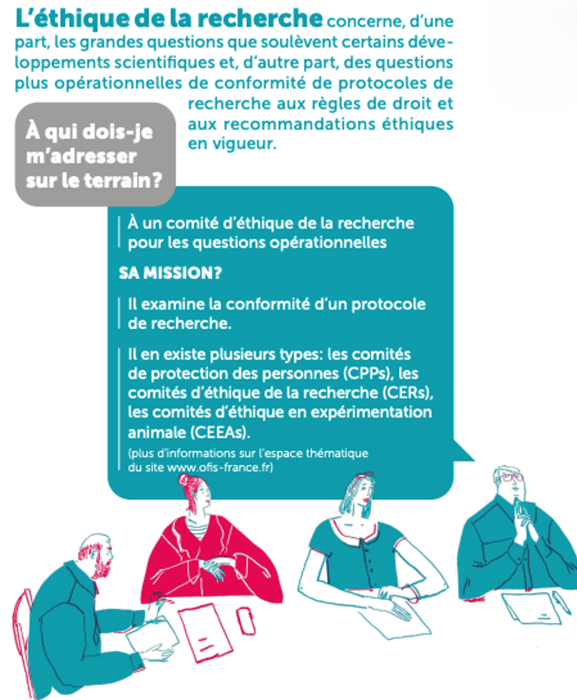{fig-alt="Ethique de la recherche"}
:::

::: {.column width="34%"}
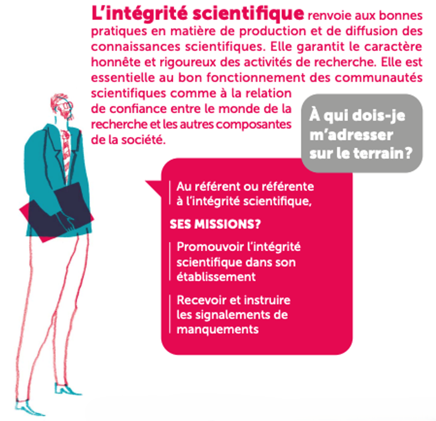{fig-alt="Integrité scientifique"}
:::

::: {.column width="32%"}
"L’objectif principal consiste à [encourager les « bonnes pratiques » en matière]{style="font-weight:bold;"} [d’éthique de la recherche](https://www.ofis-france.fr/espaces-thematiques/integrite-scientifique-ethique-de-la-recherche-deontologie/#:~:text=L'int%C3%A9grit%C3%A9%20scientifique%20est%20d%C3%A9sormais,le%20caract%C3%A8re%20honn%C3%AAte%20et%20rigoureux.), et plus largement [d’intégrité scientifique](https://www.ofis-france.fr/espaces-thematiques/integrite-scientifique-ethique-de-la-recherche-deontologie/#:~:text=L'int%C3%A9grit%C3%A9%20scientifique%20est%20d%C3%A9sormais,le%20caract%C3%A8re%20honn%C3%AAte%20et%20rigoureux.)."
:::
::::::

{.absolute right="0%" bottom="0%" width="15%" fig-alt="Logo de l'OFIS."}

## CER {.smaller style="text-align: center"}

### Comité d'Ethique de la recherche

:::::: columns
::: {.column width="34%"}
En France, l’[intégrité scientifique]{.highlighted-light} est désormais définie dans le [Code de la recherche]{.highlighted-light} (article L. 211-2) comme "[l’ensemble des règles et des valeurs qui doivent régir les activités de recherche pour en garantir le caractère honnête et rigoureux.]{style="font-weight:bold;"}"
:::

::: {.column width="34%"}
{fig-alt="Integrité scientifique"}
:::

::: {.column width="32%"}
"L’objectif principal consiste à [encourager les « bonnes pratiques » en matière]{style="font-weight:bold;"} [d’éthique de la recherche](https://www.ofis-france.fr/espaces-thematiques/integrite-scientifique-ethique-de-la-recherche-deontologie/#:~:text=L'int%C3%A9grit%C3%A9%20scientifique%20est%20d%C3%A9sormais,le%20caract%C3%A8re%20honn%C3%AAte%20et%20rigoureux.), et plus largement [d’intégrité scientifique](https://www.ofis-france.fr/espaces-thematiques/integrite-scientifique-ethique-de-la-recherche-deontologie/#:~:text=L'int%C3%A9grit%C3%A9%20scientifique%20est%20d%C3%A9sormais,le%20caract%C3%A8re%20honn%C3%AAte%20et%20rigoureux.)."
:::
::::::

{.absolute right="0%" bottom="0%" width="15%" fig-alt="Logo de l'OFIS."}

## CER {.smaller style="text-align: center"}

### Comité d'Ethique de la recherche

::::: columns
::: {.column width="68%"}
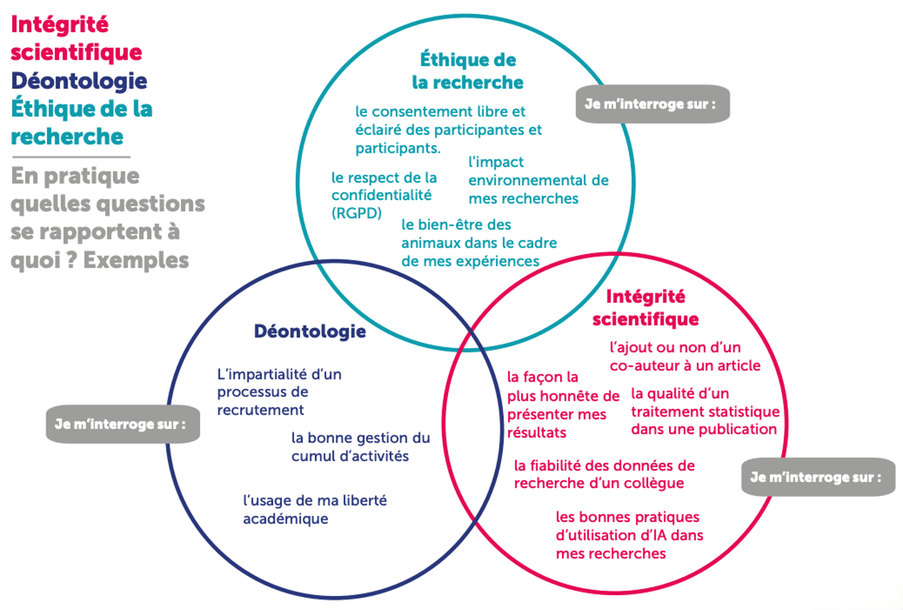{fig-alt="Diagram de Venn"}
:::

::: {.column width="32%"}
"L’objectif principal consiste à [encourager les « bonnes pratiques » en matière]{style="font-weight:bold;"} [d’éthique de la recherche](https://www.ofis-france.fr/espaces-thematiques/integrite-scientifique-ethique-de-la-recherche-deontologie/#:~:text=L'int%C3%A9grit%C3%A9%20scientifique%20est%20d%C3%A9sormais,le%20caract%C3%A8re%20honn%C3%AAte%20et%20rigoureux.), et plus largement [d’intégrité scientifique](https://www.ofis-france.fr/espaces-thematiques/integrite-scientifique-ethique-de-la-recherche-deontologie/#:~:text=L'int%C3%A9grit%C3%A9%20scientifique%20est%20d%C3%A9sormais,le%20caract%C3%A8re%20honn%C3%AAte%20et%20rigoureux.)."
:::
:::::

{.absolute right="0%" bottom="0%" width="15%" fig-alt="Logo de l'OFIS."}

## CER {.smaller style="text-align: center"}

### Comité d'Ethique de la recherche

[Par extension, permet d’]{style="font-size:18px;"}[être au clair sur le travail de recherche]{style="font-size:18px; font-weight:bold;"}[, notamment sur le protocole expérimental]{style="font-size:18px;"}

:::::::: columns
::: {.column width="30%"}
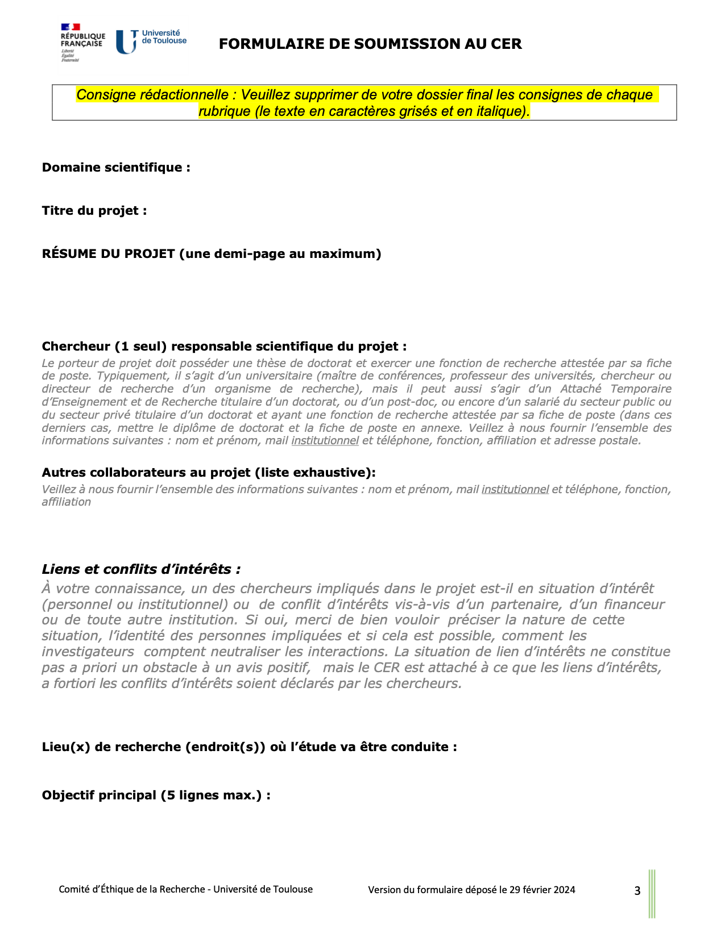{fig-alt="Ethique de la recherche"}
:::

::: {.column width="5%"}
:::

::: {.column width="30%"}
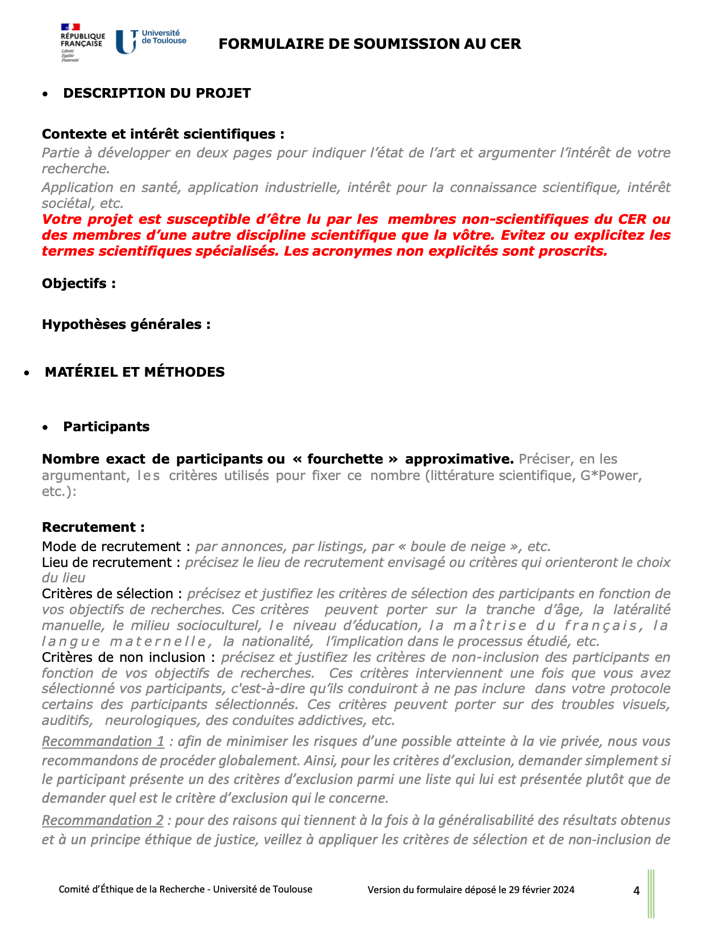{fig-alt="Integrité scientifique"}
:::

::: {.column width="5%"}
:::

::: {.column width="30%"}
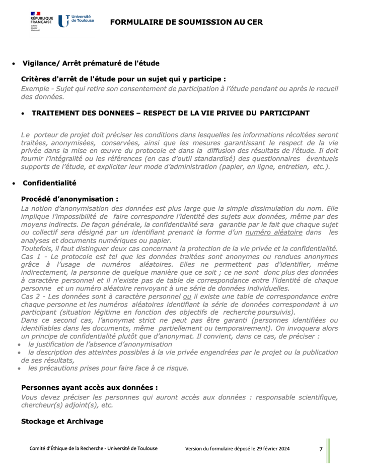{fig-alt="Integrité scientifique"}
:::
::::::::

::: aside
[https://www.univ-toulouse.fr/actualites/comite-d-ethique-de-recherche-cer](https://www.univ-toulouse.fr/actualites/comite-d-ethique-de-recherche-cer){style="font-size:15px"}
:::

## CER {.smaller style="text-align: center"}

### Comité d'Ethique de la recherche

[Permet également de]{style="font-size:18px;"} [construire la notice d’information et le consentement libre et éclairé]{style="font-size:18px; font-weight:bold;"}

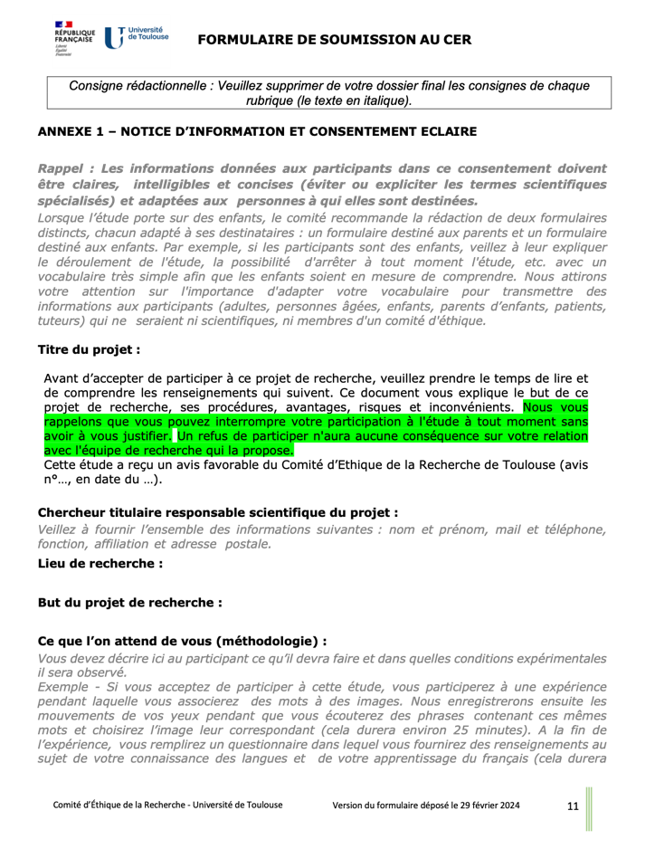{width="33%" fig-alt="Notice d'information et de consentement libre et éclairé"}

::: aside
[https://www.univ-toulouse.fr/actualites/comite-d-ethique-de-recherche-cer](https://www.univ-toulouse.fr/actualites/comite-d-ethique-de-recherche-cer){style="font-size:15px"}
:::

## Notice d'information & Consentement libre et éclairé {.smaller style="text-align: center"}

[Essentiels]{style="font-weight:bold;"} pour informer et s’assurer de l’accord des participantes/participants

::: {.absolute left="85%" right="5%" top="10%" bottom="40%" style="font-size:10px; font-weight=lighter"}
Recueil et exploitation interdites sauf dérogation (article 9 du règlement UE 2016/679)
:::

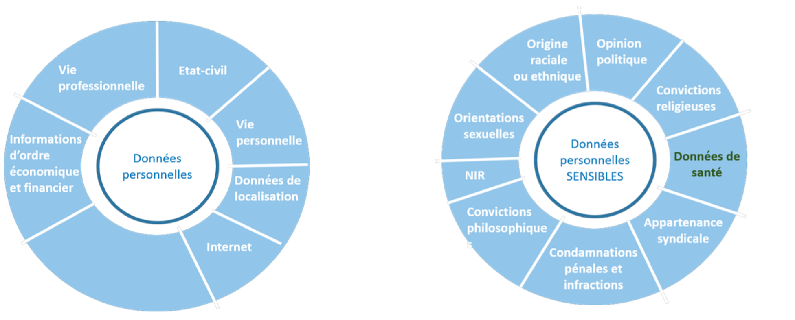{width="65%" fig-alt="Diagramme type de données"}

La [notice d’information est obligatoire]{style="font-weight:bold;"} dans tous les cas

{.absolute right="0%" bottom="0%" width="10%" fig-alt="Logo de la MSHS de Toulouse"}

::: aside
[Extrait de la formation « S’approprier le RGPD » de Sophie Corré et Sophie Estrémé]{style="font-size:15px"}
:::

## Notice d'information & Consentement libre et éclairé {.smaller style="text-align: center"}

[Essentiels]{style="font-weight:bold;"} pour informer et s’assurer de l’accord des participantes/participants

::: {.absolute left="85%" right="5%" top="10%" bottom="40%" style="font-size:10px; font-weight=lighter"}
Recueil et exploitation interdites sauf dérogation (article 9 du règlement UE 2016/679)
:::

{width="65%" fig-alt="Diagramme type de données"}

[Côté RGPD]{style="font-weight:bold;"} : [consentement obligatoire]{style="font-weight:bold;"} si participantes/participants de [-18 ans]{.highlighted-light} et/ou [données sensibles]{.highlighted-light} recueillies\
[Côté CER]{style="font-weight:bold;"} : [consentement important]{style="font-weight:bold;"} dans tous les cas d’un point de vue moral

{.absolute right="0%" bottom="0%" width="10%" fig-alt="Logo de la MSHS de Toulouse"}

::: aside
[Extrait de la formation « S’approprier le RGPD » de Sophie Corré et Sophie Estrémé]{style="font-size:15px"}
:::

## Notice d'information & Consentement libre et éclairé {.smaller style="text-align: center"}

[Essentiels]{style="font-weight:bold;"} pour informer et s’assurer de l’accord des participantes/participants

:::::::: columns
::: {.column width="30%"}
{fig-alt="Ethique de la recherche"}
:::

::: {.column width="5%"}
:::

::: {.column width="30%"}
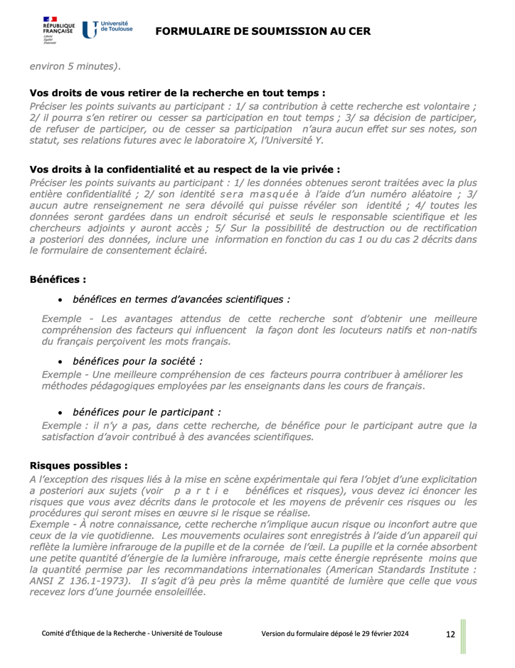{fig-alt="Integrité scientifique"}
:::

::: {.column width="5%"}
:::

::: {.column width="30%"}
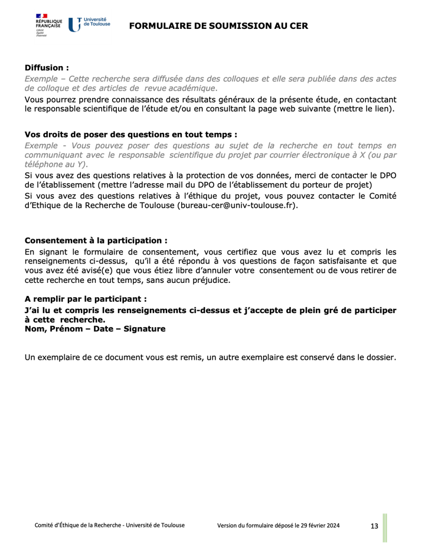{fig-alt="Integrité scientifique"} [À ajouter pour un formulaire parfait : le droit d’introduire une réclamation à la CNIL + la durée de conservation]{.absolute left="73%" right="3%" top="60%" bottom="19%" style="font-size:12px; font-weight=lighter"}
:::
::::::::

::: aside
[https://www.univ-toulouse.fr/actualites/comite-d-ethique-de-recherche-cer](https://www.univ-toulouse.fr/actualites/comite-d-ethique-de-recherche-cer){style="font-size:15px"}
:::

## RGPD {.smaller style="text-align: center"}

### Règlement Général de Protection des Données

Il [établit des règles relatives au recueil, au traitement et à la communication de données personnelles]{style="font-weight:bold;"} de participantes/participants sur le territoire de l’Union européenne

::::: columns
::: {.column .fragment width="50%" style="text-align: center; font-size:20px"}
[Données anonymisées]{.blue style="font-weight:bold; text-align: center"}\
[Cas non-soumis au RGPD]{.blue style="text-align: center"}\
"[Recouper les données ne permet pas d’identifier la personne]{style="font-weight:bold;"}."

[Données pseudonymisées]{.blue style="font-weight:bold; text-align: center"}\
[Cas soumis au RGPD]{.blue style="text-align: center"}\
"[Séparation des données pour que tout lien avec une identité ne soit possible qu’avec une information supplémentaire]{style="font-weight:bold;"}." (p. ex. numéro d’anonymat)
:::

::: {.column .fragment width="50%" style="text-align: center; font-size:20px"}
[Données directement identifiantes]{.blue style="font-weight:bold"}\
(p. ex. nom, prénom)

[Données indirectement identifiantes]{.blue style="font-weight:bold"}\
(p. ex. numéro de téléphone, identifiant)

[Identification possible à partir d’une seule donnée ou d’un]{style="font-weight:bold;"} [recoupement de données](https://video.cnil.fr/w/9jqeEoJXr7KLR7hFxN576Q)
:::
:::::

{.absolute right="0%" bottom="0%" width="10%" fig-alt="Logo de la MSHS de Toulouse"}

::: aside
[Extrait de la formation « S’approprier le RGPD » de Sophie Corré et Sophie Estrémé]{style="font-size:15px"}
:::

## RGPD {.smaller style="text-align: center"}

### Règlement Général de Protection des Données

Il [établit des règles relatives au recueil, au traitement et à la communication de données personnelles]{style="font-weight:bold;"} de participantes/participants sur le territoire de l’Union européenne

**Ne s'applique pas pour :**

-   **Données totalement anonymes** (recoupement d’informations impossible, pas de table de correspondance)

-   Données concernant des [personnes n’habitant pas sur le territoire européen]{style="font-weight:bold;"} [[et]{.underline}]{style="font-weight:bold;"} n’étant [pas traitées en Europe]{style="font-weight:bold;"}

-   Données concernant des [personnes morales]{style="font-weight:bold;"} (c’est-à-dire une entreprise, une association ou une organisation) [sans mention de personne physique]{style="font-weight:bold;"} — soumis à la loi 51-711 sur le secret statistique

{.absolute right="0%" bottom="0%" width="10%" fig-alt="Logo de la MSHS de Toulouse"}

::: aside
[Extrait de la formation « S’approprier le RGPD » de Sophie Corré et Sophie Estrémé]{style="font-size:15px"}
:::

## RGPD {.smaller style="text-align: center"}

### Règlement Général de Protection des Données

Il [établit des règles relatives au recueil, au traitement et à la communication de données personnelles]{style="font-weight:bold;"} de participantes/participants sur le territoire de l’Union européenne

**Conservation des données :**

-   Le CER préconise une **conservation** [entre 5 et 15 ans]{.highlighted-light}

-   Le mieux est de les informatiser, les [chiffrer]{style="font-weight:bold;"}, puis de les [stocker sur un serveur institutionnel/cloud académique]{style="font-weight:bold;"}

-   Le faire sur un [disque dur dans une zone fermée à clé peut être une alternative]{style="font-weight:bold;"}, avec néanmoins le [risque de panne]{style="font-weight:bold;"}, de même que sur un ordinateur il y a les risques de panne et de vol

- Le faire sur Dropbox, OneDrive, iCloud, Google Drive ou apparenté interroge sur la [souveraineté des données]{style="font-weight:bold;"}

{.absolute right="0%" bottom="0%" width="10%" fig-alt="Logo de la MSHS de Toulouse"}

::: aside
[Extrait de la formation « Stockage et sécurité des données » de Sophie Corré]{style="font-size:15px"}
:::

## Anti-plagiat {style="text-align: center"}

"Plagier c'est : s'approprier le travail créatif de quelqu'un d'autre et de le [présenter comme sien]{style="font-weight:bold;"} ; s'accaparer des extraits de texte, des images, des données, etc. provenant de sources externes et les intégrer à son propre travail [sans en mentionner la provenance]{style="font-weight:bold;"} ; résumer l'idée originale d'un auteur en l'exprimant dans ses propres mots, mais en [omettant d'en mentionner la source]{style="font-weight:bold;"}. Plagier est non seulement un acte malhonnête, mais aussi une [infraction qui peut entraîner des sanctions [disciplinaires ; p. ex. avertissement, blâme, exclusion].]{style="font-weight:bold;"}"

::: aside
[https://www.univ-tlse2.fr/accueil/vie-campus/services-numeriques/prevention-plagiat](https://www.univ-tlse2.fr/accueil/vie-campus/services-numeriques/prevention-plagiat){style="font-size:15px"}
:::

## Anti-plagiat {style="text-align: center"}

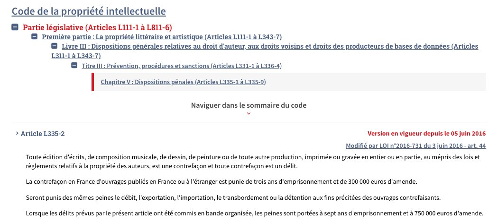{fig-align="center" fig-alt="Code de la propriété intellectuelle"} 

::: aside
[https://www.legifrance.gouv.fr/codes/article_lc/LEGIARTI000032655082](https://www.legifrance.gouv.fr/codes/article_lc/LEGIARTI000032655082){style="font-size:15px"}
:::

## Déclaration sur l'honneur contre le plagiat {style="text-align: center"}

{fig-align="center" width="53%" fig-alt="Code de la propriété intellectuelle"}

## Science Ouverte & Pré-enregistrement {.smaller style="text-align: center"}

["La plupart des résultats scientifiques sont faux"]{style="font-weight:bold;"}, car impossibles à reproduire (Ioannidis, 2005)  
Le problème de la [fidélité]{.highlighted-light}, de la [réplicabilité]{.highlighted-light} et de la [reproductibilité]{.highlighted-light} des résultats — qui concernent toutes les disciplines scientifiques — se pose à l'échelle scientifique (autant collectivement qu'individuellement), mais a également des répercussions sociétales (confiance des citoyennes/citoyens...)  

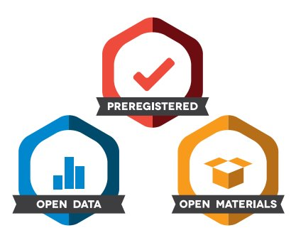{fig-align="center" width="35%" fig-alt="Code de la propriété intellectuelle"}  

::: {.r-stack .absolute top="55%" left="67%" right="-7%"}
[OSF](https://osf.io) [*– Open Science Framework*]{.highlighted-light}  
Plate-forme en ligne connue pour inciter à pratiquer la science ouverte
:::  

::: aside
[Extrait de la formation « Améliorer la qualité de la recherche/transparence, reproductibilité, réplicabilité et généralisation » de Gwenaël Kaminski]{style="font-size:15px"}
:::

# Rappels méthodologiques

## Hypothèses générales vs. opérationnelles {.smaller style="text-align: center"}

::::: columns
::: {.column .fragment data-fragment-index="1" width="50%" style="text-align: center;"}
[Hypothèses générales]{.blue style="font-weight:bold;"}
:::

::: {.column .fragment data-fragment-index="5" width="50%" style="text-align: center;"}
[Hypothèses opérationnelles]{.blue style="font-weight:bold;"}
:::
:::::

::::: columns
::: {.column .fragment data-fragment-index="2" width="50%" style="text-align: center;"}
[Définition]{style="font-weight:bold;"}\
Énoncés qui prédisent une relation entre deux variables en des termes généraux
:::

::: {.column .fragment data-fragment-index="6" width="50%" style="text-align: center;"}
[Définition]{style="font-weight:bold;"}\
Traductions d’hypothèses générales avec les outils de mesure et d’expérimentation utilisés
:::
:::::

::::: columns
::: {.column .fragment data-fragment-index="3" width="50%" style="text-align: center;"}
[Formulation]{style="font-weight:bold;"}\
Supposent que X a un effet sur Y ou que X et Y sont liés
:::

::: {.column .fragment data-fragment-index="7" width="50%" style="text-align: center;"}
[Formulation]{style="font-weight:bold;"}\
Utilisent ce qui est manipulé (modalités) et mesuré (indicateur/mesure exacte)
:::
:::::

::::: columns
::: {.column .fragment data-fragment-index="4" width="50%" style="text-align: center;"}
[Exemple]{style="font-weight:bold;"}\
"L’[âge]{.purple style="font-weight:bold;"} influence la [mémoire]{.gold style="font-weight:bold;"}."
:::

::: {.column .fragment data-fragment-index="8" width="50%" style="text-align: center;"}
[Exemple]{style="font-weight:bold;"}\
"Le [score en tâche de rappel libre]{.gold style="font-weight:bold;"} est [différent]{.blue} (hypothèse bilatérale, deux directions) entre les [15-20 ans]{.purple style="font-weight:bold;"} et les [50-55 ans]{.purple style="font-weight:bold;"}."
:::
:::::

## Hypothèses générales vs. opérationnelles {.smaller style="text-align: center"}

::::: columns
::: {.column width="50%" style="text-align: center;"}
[Hypothèses générales]{.blue style="font-weight:bold;"}
:::

::: {.column width="50%" style="text-align: center;"}
[Hypothèses opérationnelles]{.blue style="font-weight:bold;"}
:::
:::::

::::: columns
::: {.column width="50%" style="text-align: center;"}
[Définition]{style="font-weight:bold;"}\
Énoncés qui prédisent une relation entre deux variables en des termes généraux
:::

::: {.column width="50%" style="text-align: center;"}
[Définition]{style="font-weight:bold;"}\
Traductions d’hypothèses générales avec les outils de mesure et d’expérimentation utilisés
:::
:::::

::::: columns
::: {.column width="50%" style="text-align: center;"}
[Formulation]{style="font-weight:bold;"}\
Supposent que X a un effet sur Y ou que X et Y sont liés
:::

::: {.column width="50%" style="text-align: center;"}
[Formulation]{style="font-weight:bold;"}\
Utilisent ce qui est manipulé (modalités) et mesuré (indicateur/mesure exacte)
:::
:::::

::::: columns
::: {.column width="50%" style="text-align: center;"}
[Exemple]{style="font-weight:bold;"}\
"L’[âge]{.purple style="font-weight:bold;"} influence la [mémoire]{.gold style="font-weight:bold;"}."
:::

::: {.column width="50%" style="text-align: center;"}
[Exemple]{style="font-weight:bold;"}\
"Le [score en tâche de rappel libre]{.gold style="font-weight:bold;"} est [supérieur]{.blue}/[inférieur]{.blue} (hypothèse unilatérale droite/gauche, une direction) pour les [15-20 ans]{.purple style="font-weight:bold;"} comparativement aux [50-55 ans]{.purple style="font-weight:bold;"}."
:::
:::::

## Variables indépendantes vs. dépendantes {.smaller style="text-align: center"}

::::: columns
::: {.column .fragment data-fragment-index="1" width="50%" style="text-align: center;"}
[Variables indépendantes (VI)]{.purple style="font-weight:bold;"}
:::

::: {.column .fragment data-fragment-index="4" width="50%" style="text-align: center;"}
[Variables dépendantes (VD)]{.gold style="font-weight:bold;"}
:::
:::::

::::: columns
::: {.column .fragment data-fragment-index="2" width="50%" style="text-align: center;"}
[Définition]{style="font-weight:bold;"}\
Variables manipulées
:::

::: {.column .fragment data-fragment-index="5" width="50%" style="text-align: center;"}
[Définition]{style="font-weight:bold;"}\
Variables mesurées
:::
:::::

::::: columns
::: {.column .fragment data-fragment-index="3" width="50%" style="text-align: center;"}
[Exemple]{style="font-weight:bold;"}\
Hommes vs. Femmes\
Enfants vs. Adultes\
Novice vs. Experte/Expert\
[…]
:::

::: {.column .fragment data-fragment-index="6" width="50%" style="text-align: center;"}
[Exemple]{style="font-weight:bold;"}\
Performance\
Confort\
Préférences alimentaires\
[…]
:::
:::::

[Création de situations particulières à travers la [démarche expérimentale]{style="font-weight:bold;"} qui permettent de [tester l’influence d’une ou plusieurs]{style="font-weight:bold;"} [variables dites indépendantes (VI)]{.purple style="font-weight:bold;"} [sur une ou plusieurs autres]{style="font-weight:bold;"} [variables dites dépendantes (VD)]{.gold style="font-weight:bold;"}]{.fragment data-fragment-index="7" .absolute top="70%"}

## Variables indépendantes vs. dépendantes {.smaller style="text-align: center"}

::::: columns
::: {.column width="50%" style="text-align: center;"}
[Variables indépendantes (VI)]{.purple style="font-weight:bold;"}
:::

::: {.column width="50%" style="text-align: center;"}
[Variables dépendantes (VD)]{.gold style="font-weight:bold;"}
:::
:::::

::::: columns
::: {.column width="50%" style="text-align: center;"}
[Définition]{style="font-weight:bold;"}\
Variables manipulées
:::

::: {.column width="50%" style="text-align: center;"}
[Définition]{style="font-weight:bold;"}\
Variables mesurées
:::
:::::

::::: columns
::: {.column width="50%" style="text-align: center;"}
[Exemple]{style="font-weight:bold;"}\
Hommes vs. Femmes\
Enfants vs. Adultes\
Novice vs. Experte/Expert\
[…]
:::

::: {.column width="50%" style="text-align: center;"}
[Exemple]{style="font-weight:bold;"}\
Performance\
Confort\
Préférences alimentaires\
[…]
:::
:::::

[[Hypothèse : mise en lien des variables]{.highlighted-light} [indépendantes]{.purple style="font-weight:bold;"} [et]{.highlighted-light} [dépendantes]{.gold style="font-weight:bold;"} (p. ex. "L’[âge]{.purple style="font-weight:bold;"} influence la [mémoire]{.gold style="font-weight:bold;"}." en hypothèse générale)]{.absolute top="70%"}

## Variables générales vs. opérationnelles {.smaller style="text-align: center"}

::::: columns
::: {.column .fragment data-fragment-index="1" width="50%" style="text-align: center;"}
[Variables générales]{.blue style="font-weight:bold;"}
:::

::: {.column .fragment data-fragment-index="4" width="50%" style="text-align: center;"}
[Variables opérationnelles]{.blue style="font-weight:bold;"}
:::
:::::

::::: columns
::: {.column .fragment data-fragment-index="2" width="50%" style="text-align: center;"}
[Définition]{style="font-weight:bold;"}\
Concepts abstraits
:::

::: {.column .fragment data-fragment-index="5" width="50%" style="text-align: center;"}
[Définition]{style="font-weight:bold;"}\
Mesures/Catégorisations des concepts
:::
:::::

::::: columns
::: {.column .fragment data-fragment-index="3" width="50%" style="text-align: center;"}
[Exemple]{style="font-weight:bold;"}\
Âge\
Mémoire\
Cohérence d’un texte\
[…]
:::

::: {.column .fragment data-fragment-index="6" width="50%" style="text-align: center;"}
[Exemple]{style="font-weight:bold;"}\
15 ans vs. 55 ans\
Score en tâche de rappel libre\
Nombre de connecteurs dans un texte\
[…]
:::
:::::

[[Le choix d’opérationnalisation des variables les assignent dans une catégorie de variables particulière]{.highlighted-light} (p. ex. l’impact d’une [VI]{.purple style="font-weight:bold;"} sur un jugement [[VD]{.gold style="font-weight:bold;"}] : il est possible d’opérationnaliser le jugement sous la forme de réponse oui/non [[variable nominale]{.dark-blue style="font-weight:bold;"}] ou sous la forme de réponse sur une échelle de Likert [[variable ordinale]{.teal style="font-weight:bold;"}])]{.fragment data-fragment-index="7" .absolute top="65%"}

## Variables indépendantes {.smaller style="font-size:15px;"}
### 3 critères pour les définir

::: {.absolute right="0%" top="5%" style="color:#006DA3; font-size:15px;"}
[VI]{.purple style="font-weight:bold;"} agit sur [VD]{.gold style="font-weight:bold;"} et varie
:::

::: {.absolute right="0%" top="8.5%" style="color:#006DA3; font-size:15px;"}
2 modalités minimum
:::

::::: columns
::: {.column  width="16%"}
[Valeurs de la]{.red style="font-weight:bold;"} [VI]{.purple style="font-weight:bold;"}
:::

::: {.column .fragment .fade-in-then-semi-out data-fragment-index="1" width="84%"}
[Modalités]{.red style="font-weight:bold;"}

[Définition]{style="font-weight:bold;"} : correspondent aux [valeurs que peut prendre la]{.red} [VI]{.purple style="font-weight:bold;"}

[Exemple]{style="font-weight:bold;"} : la VI "difficulté de la tâche" peut prendre 2 valeurs - "facile" et "difficile" ; elle a donc deux modalités
:::
:::::

::::: columns
::: {.column width="16%"}
[Type de la]{.magenta style="font-weight:bold;"} [VI]{.purple style="font-weight:bold;"}
:::

::: {.column .fragment .fade-in-then-semi-out data-fragment-index="2" width="42%"}
[Intra-sujets/Intragroupe]{.magenta style="font-weight:bold;"}

[Définition]{style="font-weight:bold;"} : les participantes/participants [passent par toutes les modalités/conditions]{.magenta} de la [VI]{.purple style="font-weight:bold;"}

[Exemple]{style="font-weight:bold;"} : les participantes/participants vont toutes/tous effectuer la tâche en condition facile ET en condition difficile
:::

::: {.column .fragment .fade-in-then-semi-out data-fragment-index="2" width="42%"}
[Inter-sujets/Intergroupes]{.magenta style="font-weight:bold;"}

[Définition]{style="font-weight:bold;"} : les participantes/participants sont [réparti-es en groupes en fonction des modalités]{.magenta} (autant de groupes que de modalités) et [ne passent qu’une modalité/condition]{.magenta} de la [VI]{.purple style="font-weight:bold;"}

[Exemple]{style="font-weight:bold;"} : les participantes/participants vont effectuer la tâche en condition facile [OU]{.magenta} en condition difficile
:::
:::::

::::: columns
::: {.column width="16%"}
[Nature de la]{.pink style="font-weight:bold;"} [VI]{.purple style="font-weight:bold;"}
:::

::: {.column .fragment .fade-in-then-semi-out data-fragment-index="3" width="42%"}
[Invoquée]{.pink style="font-weight:bold;"}

[Définition]{style="font-weight:bold;"} : l’expérimentatrice/expérimentateur [ne peut pas directement manipuler]{.pink} la [VI]{.purple style="font-weight:bold;"} car elle est inhérente aux participantes/participants (p. ex. âge, genre)
:::

::: {.column .fragment .fade-in-then-semi-out data-fragment-index="3" width="42%"}
[Provoquée]{.pink style="font-weight:bold;"}

[Définition]{style="font-weight:bold;"} : l’expérimentatrice/expérimentateur [manipule directement]{.pink} la [VI]{.purple style="font-weight:bold;"} (p. ex. difficulté d’une tâche – facile vs. difficile)
:::
:::::

## Variables dépendantes {.smaller style="font-size:17px;"}
### Caractéristiques métriques déduites à partir des échelles de mesure

::::: columns
::: {.column  width="14%"}
[Echelle nominale]{.dark-blue style="font-weight:bold;"}
:::

::: {.column .fragment .fade-in-then-semi-out data-fragment-index="1" width="86%"}
[Objectif]{style="font-weight:bold;"} : pour les variables dont les [modalités]{.red} [ne peuvent pas être ordonnées]{.dark-blue}

[Exemples]{style="font-weight:bold;"} : genre, couleur, profession...

↳ [Indice de tendance centrale]{style="font-weight:bold;"} : [mode]{.dark-blue} | [Indice de dispersion]{style="font-weight:bold;"} : [étendue]{.dark-blue}
:::
:::::

::::: columns
::: {.column  width="14%"}
[Echelle ordinale]{.teal style="font-weight:bold;"}
:::

::: {.column .fragment .fade-in-then-semi-out data-fragment-index="2" width="86%"}
[Objectif]{style="font-weight:bold;"} : pour les variables dont les [modalités]{.red} [peuvent être ordonnées]{.teal}

[Exemples]{style="font-weight:bold;"} : taille (petit, moyen, grand), échelle de Likert (de « pas du tout d’accord » à « tout à fait d’accord)...

↳ [Indice de tendance centrale]{style="font-weight:bold;"} : [médiane]{.teal} | [Indice de dispersion]{style="font-weight:bold;"} : [écart interquartile]{.teal}
:::
:::::

::::: columns
::: {.column  width="14%"}
[Echelle d'intervalle]{.green style="font-weight:bold;"}
:::

::: {.column .fragment .fade-in-then-semi-out data-fragment-index="3" width="86%"}
[Objectif]{style="font-weight:bold;"} : pour les variables dont les [modalités]{.red} [peuvent être ordonnées]{.green} et dont l'[écart entre les modalités est égal]{.green}

[Exemples]{style="font-weight:bold;"} : température Celsius, note à un examen, score de mémoire...

↳ [Indice de tendance centrale]{style="font-weight:bold;"} : [moyenne]{.green} | [Indice de dispersion]{style="font-weight:bold;"} : [écart-type]{.green} ou [variance]{.green}
:::
:::::

[Le type d’échelle contribue à définir les statistiques à réaliser par la suite]{.highlighted-light}

## Résumé {style="text-align:center;"}

::: {.incremental .extrapad}
- La [démarche expérimentale]{.highlighted-light} essaie l’[hypothèse]{.highlighted-light} de l’[influence]{.highlighted-light} d’une ou plusieurs [VI]{.purple style="font-weight:bold;"} sur une ou plusieurs [VD]{.gold style="font-weight:bold;"}

- Une [VI]{.purple style="font-weight:bold;"} a plusieurs modalités, peut être [intra-sujets]{.magenta style="font-weight:bold;"} ou [inter-sujets]{.magenta style="font-weight:bold;"} et est [invoquée]{.pink style="font-weight:bold;"} ou [provoquée]{.pink style="font-weight:bold;"}

- Le [type d’échelle]{.highlighted-light} de la ou des [VD]{.gold style="font-weight:bold;"} ([nominale]{.dark-blue style="font-weight:bold;"}, [ordinale]{.teal style="font-weight:bold;"}, [intervalle]{.green style="font-weight:bold;"}) et le [type de]{.magenta style="font-weight:bold;"} [VI]{.purple style="font-weight:bold;"} ([intra- ou inter-sujets]{.magenta style="font-weight:bold;"}) **déterminent ensuite le test statistique** nécessaire pour **valider ou non l’hypothèse**
:::

## Résumé exemplifié {style="text-align:center;"}

# Cadre théorique

## Expertise et capacités cognitives

# Articles

## Présentation des articles {style="font-size:18px;"}
### 1 obligatoire par catégorie et 1 obligatoire par personne

::::: columns
::: {.column  width="22%"}
[Thème 1]{.red style="font-weight:bold;"}
:::

::: {.column width="74%"}
[- Article 1]{.red}
:::
:::::

## Constitution des groupes de travail {.smaller style="text-align:center; font-size:18px"}
### Prenez le temps de discuter entre vous de ce qui est important pour vous

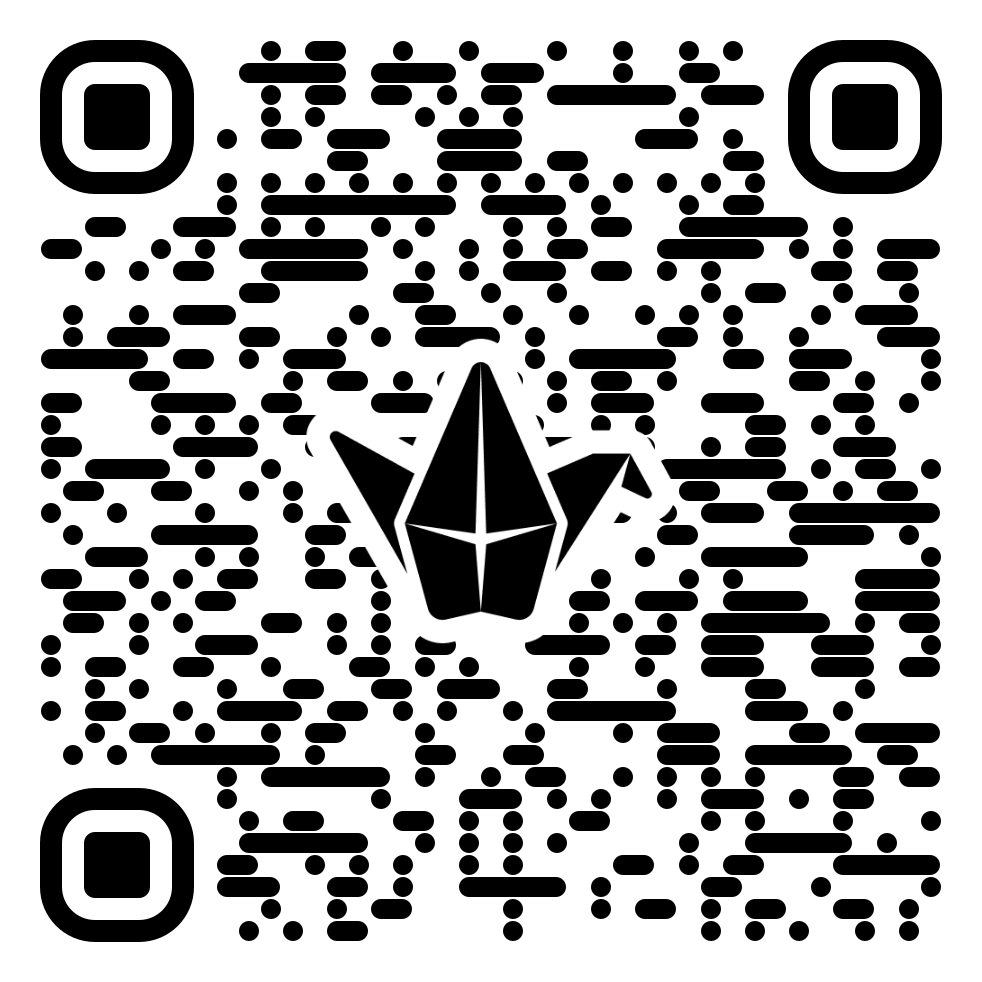{.absolute top="0%" right="-10%" width="10%" fig-alt="Un QR code renvoyant vers un Padlet pour l'organisation."}

::::: columns
::: {.column  width="23%"}
[Contraintes]{.blue style="font-weight:bold;"}

- Je travaille à côté
- Je fais du sport
- Je m’occupe d’enfants ou
de proches à moi
- Je n’ai pas ou peu de
connexion internet à mon
domicile ou pas d’ordinateur  
- Etc.
:::

::: {.column width="29%"}
[Besoins spécifiques]{.blue style="font-weight:bold;"}

- J’ai des difficultés de
concentration
- J’ai besoin de planifier les
temps de travail à l’avance
et d’être au clair sur les
consignes/rôles/attentes
- J’ai des difficultés à
prendre la parole à l’oral  
- Etc.
:::

::: {.column width="24%"}
[Profil]{.blue style="font-weight:bold;"}

- Je travaille régulièrement
ou au dernier moment
- J’apprécie/Je maîtrise
l’anglais et/ou telle partie
- J’apprécie travailler/Je
travaille de cette façon
- Je souhaite réussir l’UE  
- Etc.
:::

::: {.column width="24%"}
[Préférences]{.blue style="font-weight:bold;"}

- Être avec des personnes
que je (ne) connais (pas)
- Être avec des personnes
qui travaillent régulièrement
et/ou au dernier moment
- Être avec des personnes
qui apprécient/maîtrisent
l’anglais et/ou telle partie  
- Etc.
:::
:::::

## Organisation intragroupe {.smaller style="text-align:center;"}

:::{.extrapad}
- **Présentez-vous et faites connaissance si vous le souhaitez avec un tour de table :** qu’est-ce qui vous plaît en psychologie ? Avez-vous une idée de projet professionnel/de domaine dans lequel vous aimeriez vous spécialiser ? D’où venez-vous ? Quels sont vos principaux centres d’intérêt en dehors de la psychologie ?

- **Mettez en commun vos moyens de communication :** e-mail, n° de téléphone, groupe Messenger/WhatsApp…

- **Définissez une organisation :** répartition des rôles, créneaux durant lesquels travailler, endroits où se réunir, travail régulier toutes les semaines, travail lors d’une nuit blanche la veille des rendus… 

- **Choisissez les articles à lire selon les conditions imposées et répartissez-les entre vous :** 1 par personne
:::

## Fiche de lecture {style="text-align:center;"}
### Facultative

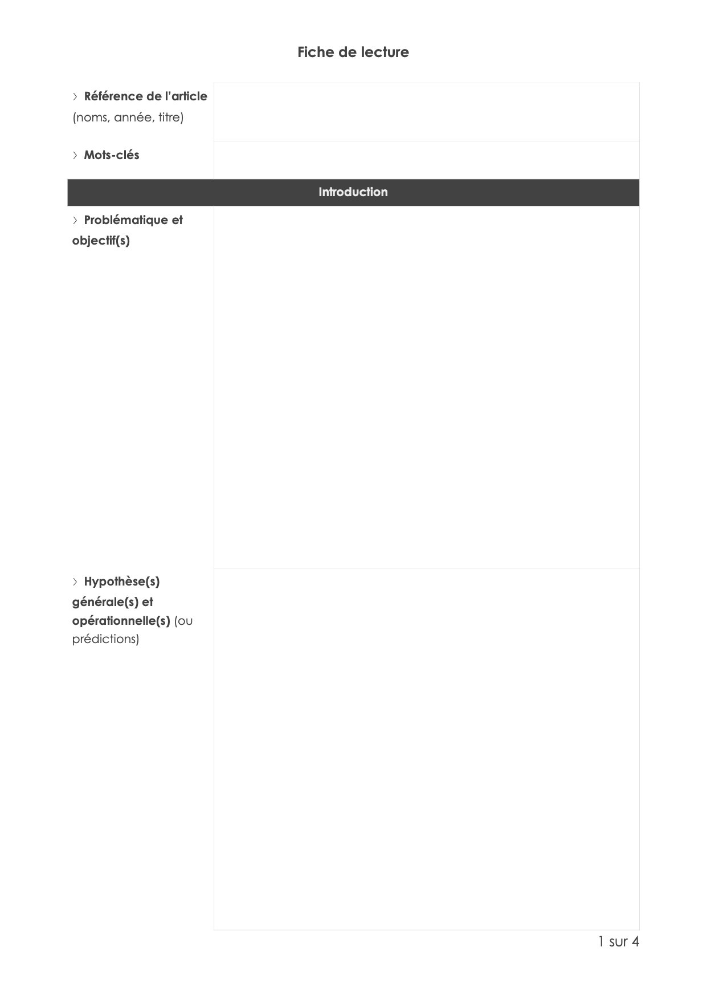{.absolute top="20%" left="-10%" width="30%" fig-alt="Première page de la fiche de lecture vierge."}
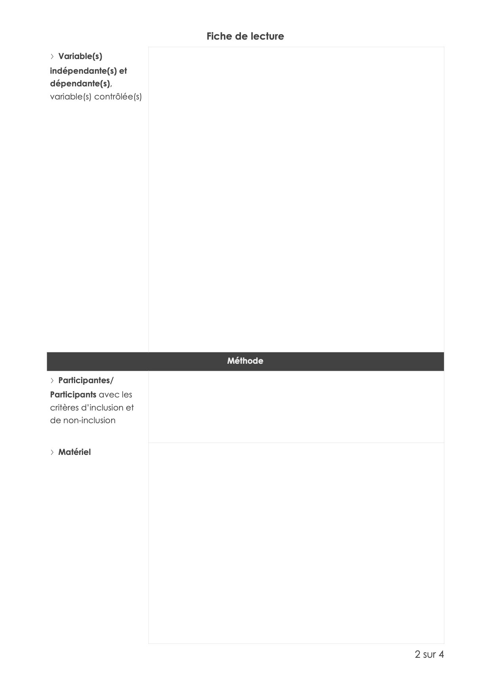{.absolute top="20%" left="20%" width="30%" fig-alt="Deuxième page de la fiche de lecture vierge."}
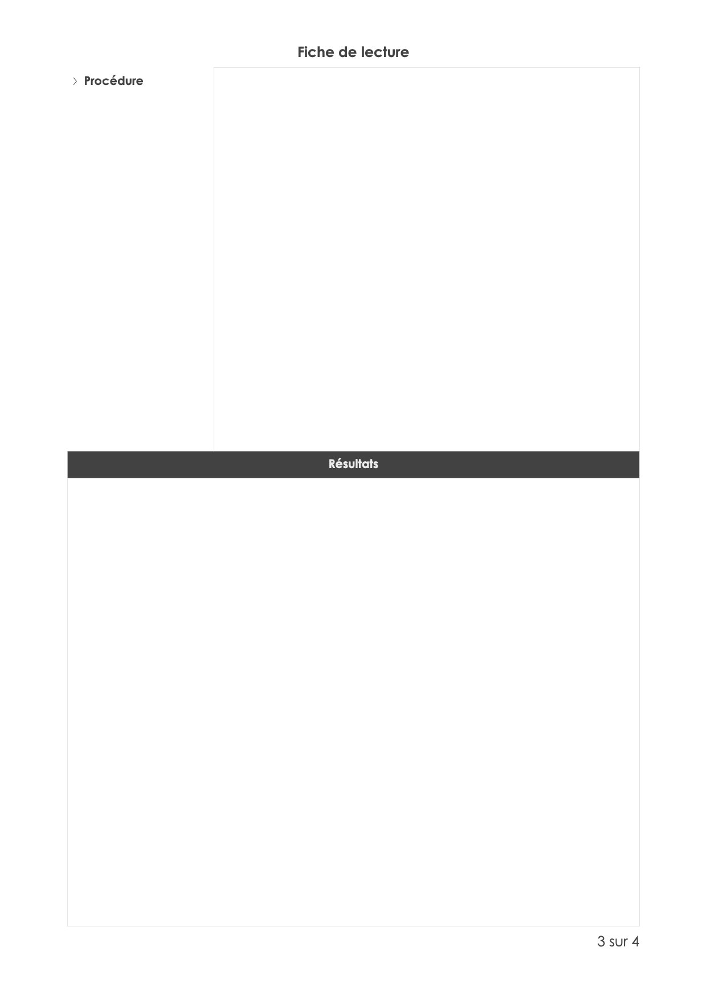{.absolute top="20%" right="20%" width="30%" fig-alt="Troisième page de la fiche de lecture vierge."}
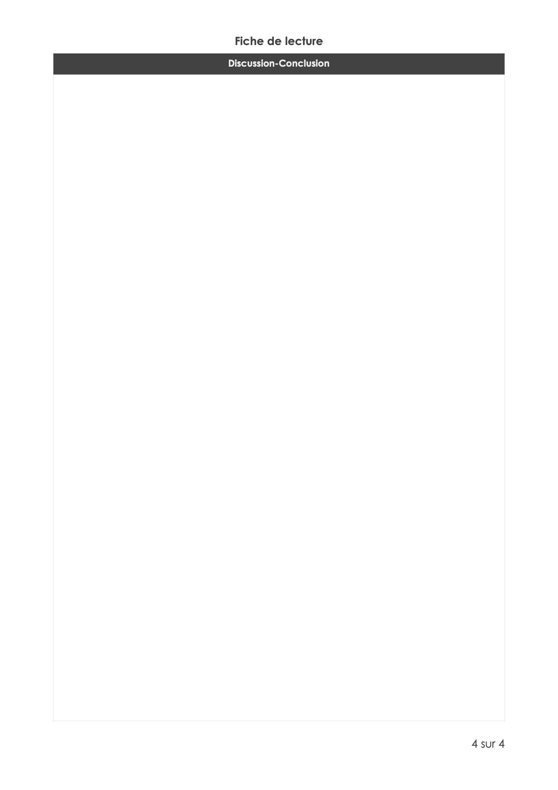{.absolute top="20%" right="-10%" width="30%" fig-alt="Quatrième page de la fiche de lecture vierge."}

# Clôture

## Objectifs par séance

::: {.absolute left="10.5%" top="24%" style="font-size:18px; font-weight:bold;"}
Pour la séance 2
:::

::: {.absolute left="-10%" top="28%" style="font-size:18px;"}
Lire les articles à l'aide (ou non) de la fiche de
:::

::: {.absolute left="-7%" top="32%" style="font-size:18px;"}
lecture et avancer sur le [rapport de synthèses]{.blue}
:::

::: {.absolute left="19.5%" top="36%" style="font-size:20px; font-weight:bold;"}
\|
:::

::: {.absolute left="48%" top="5%" style="color:#5B748F; font-size:18px; font-weight:bold;"}
Pour la séance 4
:::

::: {.absolute left="34%" top="9%" style="color:#5B748F; font-size:18px;"}
Avancer sur le [rapport de recherche]{.light-blue} ([partie]{.light-blue}
:::

::: {.absolute left="34%" top="13%" style="color:#5B748F; font-size:18px;"}
[méthode]{.light-blue}) et terminer le recueil des données
:::

::: {.absolute left="59.5%" top="17.7%" style="color:#5B748F; font-size:20px; font-weight:bold;"}
\|\
\|\
\|\
\|\
\|
:::

::: {.absolute right="-6%" top="20%" style="color:#5B748F; font-size:18px; font-weight:bold;"}
Pour la semaine suivante
:::

::: {.absolute right="-16%" top="24%" style="color:#5B748F; font-size:18px;"}
Terminer le [rapport de recherche]{.light-blue} ([parties]{.light-blue}
:::

::: {.absolute right="-14%" top="28%" style="color:#5B748F; font-size:18px;"}
[discussion-conclusion]{.light-blue}, [bibliographie]{.light-blue},
:::

::: {.absolute right="-13.3%" top="32%" style="color:#5B748F; font-size:18px;"}
[résumé]{.light-blue}, [table des matières]{.light-blue}, [annexes]{.light-blue})
:::

::: {.absolute left="99%" top="36%" style="color:#5B748F; font-size:20px; font-weight:bold;"}
\|
:::

{.absolute .r-stretch left="0%" top="40%" width="100%" fig-alt="Une barre de progression remplie à 10% et partiellement remplie à 20%, jusqu'au travail requit pour la séance 2."}

::: {.absolute left="39.5%" top="62.5%" style="color:#5B748F; font-size:20px; font-weight:bold;"}
\|
:::

::: {.absolute left="24.8%" top="66.5%" style="color:#5B748F; font-size:18px; font-weight:bold;"}
Pour la séance 3
:::

::: {.absolute left="8%" top="70.5%" style="color:#5B748F; font-size:18px;"}
Terminer le [rapport de synthèses]{.light-blue} et avancer sur
:::

::: {.absolute left="11.2%" top="74.5%" style="color:#5B748F; font-size:18px;"}
le [rapport de recherche]{.light-blue} ([mise en forme du]{.light-blue}
:::

::: {.absolute left="9.1%" top="78.5%" style="color:#5B748F; font-size:18px;"}
[document]{.light-blue}, [page de garde]{.light-blue}, [partie introduction]{.light-blue})
:::

::: {.absolute left="9.1%" top="82.5%" style="color:#5B748F; font-size:18px;"}
et l'expérience (apporter le matériel en plus
:::

::: {.absolute left="11.8%" top="86.5%" style="color:#5B748F; font-size:18px;"}
nécessaire pour construire l'expérience)
:::

::: {.absolute left="79.3%" top="62.5%" style="color:#5B748F; font-size:20px; font-weight:bold;"}
\|
:::

::: {.absolute left="78%" top="66.5%" style="color:#5B748F; font-size:18px; font-weight:bold;"}
Pour la séance 5
:::

::: {.absolute right="-5%" top="70.5%" style="color:#5B748F; font-size:18px;"}
Avancer sur le [rapport de recherche]{.light-blue}
:::

::: {.absolute left="77%" top="74.5%" style="color:#5B748F; font-size:18px;"}
(partie [résultats]{.light-blue})
:::

## {.dark-theme .center style="text-align:center;"}

Remerciements pour la construction de ces contenus de cours à

**YOAN SEGURA**

**AURÉLIE PISTONO**

**MAGALI BRINGUIER**

**ZOÉ LACROUX**

# Drafts

## Tests

::::: columns
::: {.column .fragment width="50%" style="text-align: center;"}
[Hypothèses générales]{.blue style="font-weight:bold;"}

[Définition]{style="font-weight:bold;"}\
Énoncés qui prédisent une relation entre deux variables en des termes généraux

[Formulation]{style="font-weight:bold;"}\
Supposent que X a un effet sur Y ou que X et Y sont liés

[Exemple]{style="font-weight:bold;"}\
"L’[âge]{.purple style="font-weight:bold;"} influence la [mémoire]{.gold style="font-weight:bold;"}."
:::

::: {.column .fragment width="50%" style="text-align: center;"}
[Hypothèses opérationnelles]{.blue style="font-weight:bold;"}

[Définition]{style="font-weight:bold;"}\
Traductions d’hypothèses générales avec les outils de mesure et d’expérimentation utilisés

[Formulation]{style="font-weight:bold;"}\
Utilisent ce qui est manipulé (modalités) et mesuré (indicateur/mesure exacte)

[Exemple]{style="font-weight:bold;"}\
"Le [score en tâche de rappel libre]{.gold style="font-weight:bold;"} est [différent]{.blue} (hypothèse bilatérale, deux directions) entre les [15-20 ans]{.purple style="font-weight:bold;"} et les [50-55 ans]{.purple style="font-weight:bold;"}."
:::
:::::

TD1 -\> make the timeline in svg format with inkscape then place text using absolute positioning Maybe change all placements/sizes of images to % instead of pixel values? I'm afraid it might look weird on some devices if I keep absolute values Add a follow-along version of the presentation (you can apparently do that with Quarto)

{.img-fluid .r-stretch fig-align="center" width="100%" fig-alt="Frise chronologique du premier semestre."}

## Attendus {.smaller}

### Rapport de synthèse (CC1)

#### Contenu

::: {.absolute right="0%" top="13.5%" style="color:#006DA3; font-size:18px;"}
50% de la note de l'UE
:::

::: {.absolute right="0%" top="17%" style="color:#006DA3; font-size:18px;"}
+20 points
:::

:::::: columns
::: {.column width="30%"}
\> [Introduction]{.red}
:::

::: {.column width="14%"}
:::

::: {.column width="56%"}
-   [Question de recherche et hypothèses]{.red}
-   [Arguments théoriques]{.red}
:::
::::::

:::::: columns
::: {.column width="24%"}
\> [Méthode]{.purple}
:::

::: {.column width="20%"}
3-5 pages\
par article
:::

::: {.column width="56%"}
-   [Participantes/participants]{.purple}
-   [Matériel]{.purple}
-   [Procédure]{.purple}
-   [Variables indépendantes et dépendantes]{.purple}
:::
::::::

:::::: columns
::: {.column width="30%"}
\> [Résultats]{.blue}
:::

::: {.column width="14%"}
:::

::: {.column width="56%"}
-   [Descriptifs incluant des données chiffrées]{.blue}
-   [Lecture d'un tableau et/ou d'un graphique]{.blue}
:::
::::::

:::::: columns
::: {.column width="30%"}
\> [Discussion-conclusion]{.teal}
:::

::: {.column width="14%"}
:::

::: {.column width="56%"}
-   [Synthèse/Discussion des hypothèses]{.teal}
-   [Thématiques de discussion]{.teal}
:::
::::::

## Attendus {.smaller}

### Rapport de synthèse (CC1)

#### Contenant et respect des consignes

::: {.absolute right="0%" top="17%" style="color:#006DA3; font-size:18px;"}
-20 points
:::

::::: columns
::: {.column width="35%"}
\> [Normes APA]{.red}
:::

::: {.column width="65%"}
-   [Tableaux et figures]{.red}
-   [Format de la référence de l'article lu aux normes]{.red}
:::
:::::

::::: columns
::: {.column width="35%"}
\> [Orthographe, grammaire, syntaxe et conjugaison]{.purple}
:::

::: {.column width="65%"}
-   [Points en moins toutes les 2 fautes dans une limite de 10 fautes]{.purple}
:::
:::::

::::: columns
::: {.column width="35%"}
\> [Respect des consignes]{.blue}
:::

::: {.column width="65%"}
-   [Qualité des autres synthèses d'articles]{.blue}
:::
:::::

## Attendus {.smaller .scrollable}

### Rapport de recherche (CC2)

#### Contenu

::: {.absolute right="0%" top="13.5%" style="color:#006DA3; font-size:18px;"}
50% de la note de l'UE
:::

::: {.absolute right="0%" top="17%" style="color:#006DA3; font-size:18px;"}
+20 points
:::

:::::: columns
::: {.column width="22%"}
\> [Page de garde]{.gold}
:::

::: {.column width="12%"}
[1 page]{.gold}
:::

::: {.column width="66%"}
-   [Choix d'un titre explicite, clair et synthétique]{.gold}
:::
::::::

:::::: columns
::: {.column width="22%"}
\> [Résumé]{.red}
:::

::: {.column width="12%"}
[250 mots max.]{.red}
:::

::: {.column width="66%"}
-   [Présentation des différents points du rapport : introduction, méthodologie, résultats, discussion-conclusion]{.red}
:::
::::::

:::::: columns
::: {.column width="22%"}
\> [Introduction]{.pink}
:::

::: {.column width="12%"}
[2-3 pages]{.pink}
:::

::: {.column width="66%"}
-   [Orientation vers la lectrice/le lecteur et articulation claire et correcte des paragraphes en entonnoir]{.pink}
-   [Présentation de la problématique dans un champ thématique défini]{.pink}
-   [Présentation de la question de recherche et de l’hypothèse générale en lien avec la problématique]{.pink}
-   [Utilisation d’au moins 3 des articles proposés durant les TD]{.pink}
-   [Utilisation d’autres références (articles scientifiques, chapitres d’ouvrages scientifiques…)]{.pink}
:::
::::::

:::::: columns
::: {.column width="22%"}
\> [Méthode]{.purple}
:::

::: {.column width="12%"}
[2-3 pages]{.purple}
:::

::: {.column width="66%"}
-   [Définition des participantes/participants]{.purple}
-   [Présentation du matériel/dispositif expérimental]{.purple}
-   [Présentation de la procédure]{.purple}
-   [Présentation et définition des variables indépendantes et dépendantes]{.purple}
-   [Présentation des hypothèses opérationnelles]{.purple}
:::
::::::

:::::: columns
::: {.column width="22%"}
\> [Résultats]{.dark-blue}
:::

::: {.column width="12%"}
[2-3 pages]{.dark-blue}
:::

::: {.column width="66%"}
-   [Analyse descriptive et/ou inférentielle des résultats]{.dark-blue}
-   [Représentation graphique et éventuellement tableau des résultats]{.dark-blue}
:::
::::::

:::::: columns
::: {.column width="22%"}
\> [Discussion-conclusion]{.blue}
:::

::: {.column width="12%"}
[2-3.5 pages]{.blue}
:::

::: {.column width="66%"}
-   [Présentation d’un résumé des résultats au regard de l’hypothèse posée et itérations avec la littérature]{.blue}
-   [Ouverture vers de nouvelles perspectives de recherche​]{.blue}
:::
::::::

:::::: columns
::: {.column width="22%"}
\> [Bibliography]{.teal}
:::

::: {.column width="12%"}
[-]{.teal}
:::

::: {.column width="66%"}
-   [Présentation des références citées dans le texte uniquement]{.teal}
:::
::::::

:::::: columns
::: {.column width="22%"}
\> [Annexes]{.green}
:::

::: {.column width="12%"}
[-]{.green}
:::

::: {.column width="66%"}
[-]{.green}
:::
::::::

## Attendus {.smaller .scrollable}

### Rapport de recherche (CC2)

#### Contenant et respect des consignes

::: {.absolute right="0%" top="17%" style="color:#006DA3; font-size:18px;"}
-20 points
:::

::::: columns
::: {.column width="40%"}
\> [Mise en forme générale APA]{.red}
:::

::: {.column width="60%"}
-   [Non respect des formats titres et sous-titres]{.red}
-   [Non respect des normes de présentation des références dans le texte]{.red}
-   [Non respect des normes de présentation des figures/tableaux]{.red}
:::
:::::

::::: columns
::: {.column width="40%"}
\> [Références bibliographiques APA]{.pink}
:::

::: {.column width="60%"}
-   [Non respect des normes de rédaction des références dans la partie bibliographique]{.pink}
:::
:::::

::::: columns
::: {.column width="40%"}
\> [Orthographe, grammaire, syntaxe et conjugaison]{.purple}
:::

::: {.column width="60%"}
-   [\< ou = à 5 fautes]{.purple}
-   [De 5 à 10 fautes]{.purple}
-   [\> 10 fautes]{.purple}
:::
:::::

::::: columns
::: {.column width="40%"}
\> [Cohérence]{.blue}
:::

::: {.column width="60%"}
-   [Cohérence interne du rapport entre ses parties non respectée]{.blue}
:::
:::::

::::: columns
::: {.column width="40%"}
\> [Respect des consignes de recueil des données]{.teal}
:::

::: {.column width="60%"}
-   [Nombre de participantes/participants défini en TD par étudiante/étudiant non respecté]{.teal}
:::
:::::