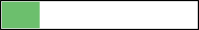
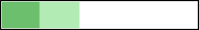

# Organisation

## Le mur des questions

::: r-stack
[padlet.com/elichaput/PY00302T](padlet.com/elichaput/PY00302T){style="font-size:20px;"}
:::

{fig-align="center" width="75%" fig-alt="Un Padlet intitulé « mur des questions »"}

{.absolute top="45%" right="-10%" width="15%" fig-alt="Un QR code renvoyant vers le même Padlet que le lien."}

## Objectifs par séance

::: {.absolute left="10.5%" top="24%" style="color:#2E8A48; font-size:18px; font-weight:bold;"}
Pour la séance 2
:::

::: {.absolute left="-10%" top="28%" style="color:#2E8A48; font-size:18px;"}
Lire les articles à l'aide (ou non) de la fiche de
:::

::: {.absolute left="-7%" top="32%" style="color:#2E8A48; font-size:18px;"}
lecture et avancer sur le rapport de synthèses
:::

::: {.absolute left="19.5%" top="36%" style="color:#2E8A48; font-size:20px; font-weight:bold;"}
\|
:::

::: {.absolute left="48%" top="5%" style="color:#5B748F; font-size:18px; font-weight:bold;"}
Pour la séance 4
:::

::: {.absolute left="34%" top="9%" style="color:#5B748F; font-size:18px;"}
Avancer sur le [rapport de recherche]{.light-blue} ([partie]{.light-blue}
:::

::: {.absolute left="34%" top="13%" style="color:#5B748F; font-size:18px;"}
[méthode]{.light-blue}) et terminer le recueil des données
:::

::: {.absolute left="59.5%" top="17.7%" style="color:#5B748F; font-size:20px; font-weight:bold;"}
\|\
\|\
\|\
\|\
\|
:::

::: {.absolute right="-6%" top="20%" style="color:#5B748F; font-size:18px; font-weight:bold;"}
Pour la semaine suivante
:::

::: {.absolute right="-16%" top="24%" style="color:#5B748F; font-size:18px;"}
Terminer le [rapport de recherche]{.light-blue} ([parties]{.light-blue}
:::

::: {.absolute right="-14%" top="28%" style="color:#5B748F; font-size:18px;"}
[discussion-conclusion]{.light-blue}, [bibliographie]{.light-blue},
:::

::: {.absolute right="-13.3%" top="32%" style="color:#5B748F; font-size:18px;"}
[résumé]{.light-blue}, [table des matières]{.light-blue}, [annexes]{.light-blue})
:::

::: {.absolute left="99%" top="36%" style="color:#5B748F; font-size:20px; font-weight:bold;"}
\|
:::

{.absolute .r-stretch left="0%" top="40%" width="100%" fig-alt="Une barre de progression remplie à 10%, avant le travail requit pour la séance 2."}

::: {.absolute left="39.5%" top="62.5%" style="color:#5B748F; font-size:20px; font-weight:bold;"}
\|
:::

::: {.absolute left="24.8%" top="66.5%" style="color:#5B748F; font-size:18px; font-weight:bold;"}
Pour la séance 3
:::

::: {.absolute left="8%" top="70.5%" style="color:#5B748F; font-size:18px;"}
Terminer le [rapport de synthèses]{.light-blue} et avancer sur
:::

::: {.absolute left="11.2%" top="74.5%" style="color:#5B748F; font-size:18px;"}
le [rapport de recherche]{.light-blue} ([mise en forme du]{.light-blue}
:::

::: {.absolute left="9.1%" top="78.5%" style="color:#5B748F; font-size:18px;"}
[document]{.light-blue}, [page de garde]{.light-blue}, [partie introduction]{.light-blue})
:::

::: {.absolute left="9.1%" top="82.5%" style="color:#5B748F; font-size:18px;"}
et l'expérience (apporter le matériel en plus
:::

::: {.absolute left="11.8%" top="86.5%" style="color:#5B748F; font-size:18px;"}
nécessaire pour construire l'expérience)
:::

::: {.absolute left="79.3%" top="62.5%" style="color:#5B748F; font-size:20px; font-weight:bold;"}
\|
:::

::: {.absolute left="78%" top="66.5%" style="color:#5B748F; font-size:18px; font-weight:bold;"}
Pour la séance 5
:::

::: {.absolute right="-5%" top="70.5%" style="color:#5B748F; font-size:18px;"}
Avancer sur le [rapport de recherche]{.light-blue}
:::

::: {.absolute left="77%" top="74.5%" style="color:#5B748F; font-size:18px;"}
(partie [résultats]{.light-blue})
:::

# Intelligence Artificielle

## Rôle de l'Intelligence Artificielle (IA) dans les apprentissages

# Clôture

## Objectifs par séance

::: {.absolute left="10.5%" top="24%" style="color:#2E8A48; font-size:18px; font-weight:bold;"}
Pour la séance 2
:::

::: {.absolute left="-10%" top="28%" style="color:#2E8A48; font-size:18px;"}
Lire les articles à l'aide (ou non) de la fiche de
:::

::: {.absolute left="-7%" top="32%" style="color:#2E8A48; font-size:18px;"}
lecture et avancer sur le rapport de synthèses
:::

::: {.absolute left="19.5%" top="36%" style="color:#2E8A48; font-size:20px; font-weight:bold;"}
\|
:::

::: {.absolute left="48%" top="5%" style="color:#5B748F; font-size:18px; font-weight:bold;"}
Pour la séance 4
:::

::: {.absolute left="34%" top="9%" style="color:#5B748F; font-size:18px;"}
Avancer sur le [rapport de recherche]{.light-blue} ([partie]{.light-blue}
:::

::: {.absolute left="34%" top="13%" style="color:#5B748F; font-size:18px;"}
[méthode]{.light-blue}) et terminer le recueil des données
:::

::: {.absolute left="59.5%" top="17.7%" style="color:#5B748F; font-size:20px; font-weight:bold;"}
\|\
\|\
\|\
\|\
\|
:::

::: {.absolute right="-6%" top="20%" style="color:#5B748F; font-size:18px; font-weight:bold;"}
Pour la semaine suivante
:::

::: {.absolute right="-16%" top="24%" style="color:#5B748F; font-size:18px;"}
Terminer le [rapport de recherche]{.light-blue} ([parties]{.light-blue}
:::

::: {.absolute right="-14%" top="28%" style="color:#5B748F; font-size:18px;"}
[discussion-conclusion]{.light-blue}, [bibliographie]{.light-blue},
:::

::: {.absolute right="-13.3%" top="32%" style="color:#5B748F; font-size:18px;"}
[résumé]{.light-blue}, [table des matières]{.light-blue}, [annexes]{.light-blue})
:::

::: {.absolute left="99%" top="36%" style="color:#5B748F; font-size:20px; font-weight:bold;"}
\|
:::

{.absolute .r-stretch left="0%" top="40%" width="100%" fig-alt="Une barre de progression remplie à 10% et partiellement remplie à 20%, jusqu'au travail requit pour la séance 2."}

::: {.absolute left="39.5%" top="62.5%" style="font-size:20px; font-weight:bold;"}
\|
:::

::: {.absolute left="24.8%" top="66.5%" style="font-size:18px; font-weight:bold;"}
Pour la séance 3
:::

::: {.absolute left="8%" top="70.5%" style="font-size:18px;"}
Terminer le [rapport de synthèses]{.light-blue} et avancer sur
:::

::: {.absolute left="11.2%" top="74.5%" style="font-size:18px;"}
le [rapport de recherche]{.light-blue} ([mise en forme du]{.light-blue}
:::

::: {.absolute left="9.1%" top="78.5%" style="font-size:18px;"}
[document]{.light-blue}, [page de garde]{.light-blue}, [partie introduction]{.light-blue})
:::

::: {.absolute left="9.1%" top="82.5%" style="font-size:18px;"}
et l'expérience (apporter le matériel en plus
:::

::: {.absolute left="11.8%" top="86.5%" style="font-size:18px;"}
nécessaire pour construire l'expérience)
:::

::: {.absolute left="79.3%" top="62.5%" style="color:#5B748F; font-size:20px; font-weight:bold;"}
\|
:::

::: {.absolute left="78%" top="66.5%" style="color:#5B748F; font-size:18px; font-weight:bold;"}
Pour la séance 5
:::

::: {.absolute right="-5%" top="70.5%" style="color:#5B748F; font-size:18px;"}
Avancer sur le [rapport de recherche]{.light-blue}
:::

::: {.absolute left="77%" top="74.5%" style="color:#5B748F; font-size:18px;"}
(partie [résultats]{.light-blue})
:::

##  {.dark-theme .center style="text-align:center;"}

Remerciements pour la construction de ces contenus de cours à

**YOAN SEGURA**

**AURÉLIE PISTONO**

**MAGALI BRINGUIER**

**ZOÉ LACROUX**
