# Organisation

## Le mur des questions

::: r-stack
[padlet.com/elichaput/PY00302T](https://padlet.com/elichaput/py00302t-mur-des-questions-5wr05uxj8nlbdqa0){style="font-size:20px;"}
:::

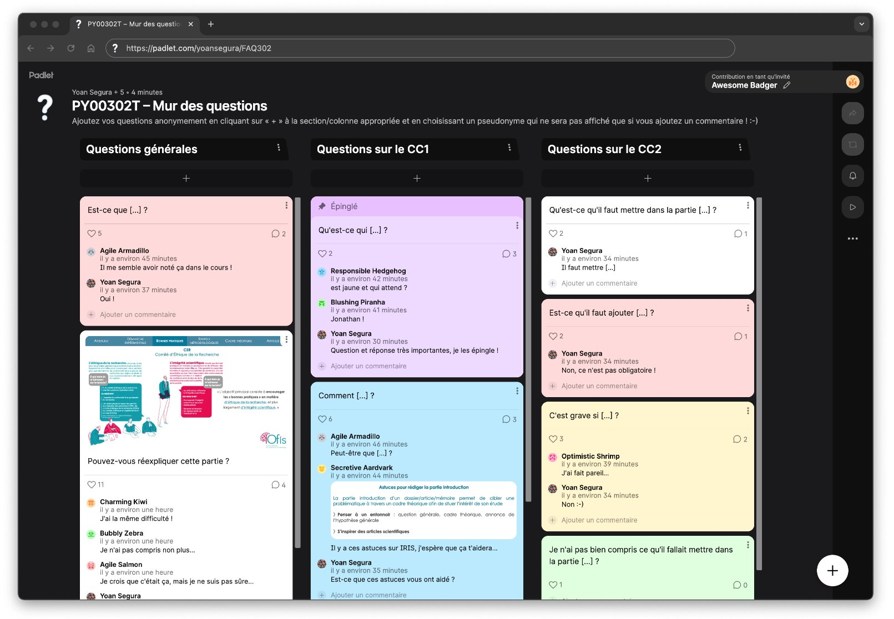{fig-align="center" width="75%" fig-alt="Un Padlet intitulé « mur des questions »"}

{.absolute top="45%" right="-10%" width="15%" fig-alt="Un QR code renvoyant vers le même Padlet que le lien."}

## Objectifs par séance

::: {.absolute left="10.5%" top="24%" style="color:#2E8A48; font-size:18px; font-weight:bold;"}
Pour la séance 2
:::

::: {.absolute left="-10%" top="28%" style="color:#2E8A48; font-size:18px;"}
Lire les articles à l'aide (ou non) de la fiche de
:::

::: {.absolute left="-7%" top="32%" style="color:#2E8A48; font-size:18px;"}
lecture et avancer sur le rapport de synthèses
:::

::: {.absolute left="19.5%" top="36%" style="color:#2E8A48; font-size:20px; font-weight:bold;"}
\|
:::

::: {.absolute left="48%" top="5%" style="color:#5B748F; font-size:18px; font-weight:bold;"}
Pour la séance 4
:::

::: {.absolute left="34%" top="9%" style="color:#5B748F; font-size:18px;"}
Avancer sur le [rapport de recherche]{.light-blue} ([partie]{.light-blue}
:::

::: {.absolute left="34%" top="13%" style="color:#5B748F; font-size:18px;"}
[méthode]{.light-blue}) et terminer le recueil des données
:::

::: {.absolute left="59.5%" top="17.7%" style="color:#5B748F; font-size:20px; font-weight:bold;"}
\|\
\|\
\|\
\|\
\|
:::

::: {.absolute right="-6%" top="20%" style="color:#5B748F; font-size:18px; font-weight:bold;"}
Pour la semaine suivante
:::

::: {.absolute right="-16%" top="24%" style="color:#5B748F; font-size:18px;"}
Terminer le [rapport de recherche]{.light-blue} ([parties]{.light-blue}
:::

::: {.absolute right="-14%" top="28%" style="color:#5B748F; font-size:18px;"}
[discussion-conclusion]{.light-blue}, [bibliographie]{.light-blue},
:::

::: {.absolute right="-13.3%" top="32%" style="color:#5B748F; font-size:18px;"}
[résumé]{.light-blue}, [table des matières]{.light-blue}, [annexes]{.light-blue})
:::

::: {.absolute left="99%" top="36%" style="color:#5B748F; font-size:20px; font-weight:bold;"}
\|
:::

{.absolute .r-stretch left="0%" top="40%" width="100%" fig-alt="Une barre de progression remplie à 10%, avant le travail requit pour la séance 2."}

::: {.absolute left="39.5%" top="62.5%" style="color:#5B748F; font-size:20px; font-weight:bold;"}
\|
:::

::: {.absolute left="24.8%" top="66.5%" style="color:#5B748F; font-size:18px; font-weight:bold;"}
Pour la séance 3
:::

::: {.absolute left="8%" top="70.5%" style="color:#5B748F; font-size:18px;"}
Terminer le [rapport de synthèses]{.light-blue} et avancer sur
:::

::: {.absolute left="11.2%" top="74.5%" style="color:#5B748F; font-size:18px;"}
le [rapport de recherche]{.light-blue} ([mise en forme du]{.light-blue}
:::

::: {.absolute left="9.1%" top="78.5%" style="color:#5B748F; font-size:18px;"}
[document]{.light-blue}, [page de garde]{.light-blue}, [partie introduction]{.light-blue})
:::

::: {.absolute left="9.1%" top="82.5%" style="color:#5B748F; font-size:18px;"}
et l'expérience (apporter le matériel en plus
:::

::: {.absolute left="11.8%" top="87.5%" style="color:#5B748F; font-size:18px;"}
nécessaire pour construire l'expérience)
:::

::: {.absolute left="79.3%" top="62.5%" style="color:#5B748F; font-size:20px; font-weight:bold;"}
\|
:::

::: {.absolute left="78%" top="66.5%" style="color:#5B748F; font-size:18px; font-weight:bold;"}
Pour la séance 5
:::

::: {.absolute right="-5%" top="70.5%" style="color:#5B748F; font-size:18px;"}
Avancer sur le [rapport de recherche]{.light-blue}
:::

::: {.absolute left="77%" top="74.5%" style="color:#5B748F; font-size:18px;"}
(partie [résultats]{.light-blue})
:::

# Intelligence Artificielle

## Rôle de l'Intelligence Artificielle (IA) dans les apprentissages {.smaller style="text-align: center"}

### Ouvrons le débat !

:::::: columns
::: {#vcenter .column width="32%"}
[Utilisez-vous fréquemment des IA comme]{style="font-weight: bold"}[ChatGPT]{.highlighted-light} ?
:::

::: {.column width="36%"}
{fig-align="center" width="100%" fig-alt="Un meme sur l'utilisation de ChatGPT pour faire son travail."} [What do you think?]{style="font-weight: lighter"}
:::

::: {.column width="32%"}
[Percevez-vous parfois des]{style="font-weight: bold"}[limites]{.highlighted-light} et/ou des [désavantages]{.highlighted-light} à cette utilisation ?
:::
::::::

::: notes
– Il nous paraissait intéressant d’introduire dans cette UE un débat sur l’IA au regard de son utilisation quotidienne

– Je ne suis pas spécialiste, l’idée est d’échanger avec vous en toute transparence sans aucun jugement ni tabou

– Avant de montrer les questions, ouvrir la discussion sur le fait qu’il n’y a pas de jugements ou mauvaises réponses : il s’agit pour nous de mieux comprendre leur utilisation pour mieux les guider !

– «Utilisez-vous fréquemment des IA comme ChatGPT ?» : l’idée est de savoir si l’utilisation est quotidienne et pour quels usages (uniquement les cours ou pas)

– «Percevez-vous parfois des limites ou désavantages à cette utilisation ?» : l’idée est de savoir si elles/s’ils perçoivent 1) que ça peut limiter leurs apprentissages selon la façon dont elles/ils l’utilisent ; et 2) que ces outils ne sont pas fiables

– Meme : plusieurs niveaux de lecture, le but est de les amener à penser chaque niveau (spontanément, dans l’idéal)\
1) Qu’en pensez-vous en termes de futur ? Est-ce une crainte ?\
2) Qu’en pensez-vous en termes d’apprentissage au jour le jour ?\
3) Et du point de vue des enseignantes/enseignants : pensez-vous qu’elles/ils se posent ces questions ? Et qu’elles/ils y répondent/réagissent efficacement ?
:::

## Rôle de l'Intelligence Artificielle (IA) dans les apprentissages {.smaller style="text-align: center; font-size: 20px"}

### Ouvrons le débat !

Avec l'IA, [la question n’est pas simplement "comment évaluer les étudiantes/étudiants ?" ou "comment empêcher son utilisation ?"]{style="font-weight: bold"}

- [Qu’est-ce que ChatGPT ?]{style="font-weight: bold"}\
  Un [modèle de langage]{.blue} : il prédit le mot suivant en se basant sur d'énormes bases de textes\
  Il n’a pas de compréhension du monde, il fait fréquemment des [erreurs]{.blue} et est sujet à des [hallucinations]{.blue}\
  [↳ Enjeu n°1: ne pas le prendre pour plus intelligent qu’il ne l’est réellement]{.highlighted-light}

- [Chaque requête consomme de l'énergie]{style="font-weight: bold"}\
  GPT-3 : jusqu’à 0,1 kWh par requête ≈ [une charge de smartphone]{.blue}\
  Refroidissement des serveurs : [centaines de milliers de litres d’eau]{.blue}\
  [↳ Enjeu n°2 : ce n’est pas gratuit pour la planète]{.highlighted-light}

::: aside
[Pour aller plus loin : conférence sur l’IA par Jean-Gabriel Ganascia en]{style="font-size:15px"} [cliquant ici](www.univ-tlse2.fr/accueil/recherche/en-quoi-lia-transforme-les-pratiques-dans-lenseignement-superieur-et-la-recherche){style="font-size:15px"}
:::

::: notes
– Pour rebondir sur le dernier point (enseignantes/enseignants), l’IA n’est pas un outil à empêcher/contrôler à tout prix, mais à prendre en compte désormais

– En revanche, il faut prendre certaines précautions et bien comprendre les enjeux

– S’assurer qu’elles/ils connaissent la différence entre erreurs et hallucinations

– Source en lien cliquable sur la diapositive : https://www.univ-tlse2.fr/accueil/recherche/en-quoi-lia-transforme-les-pratiques-dans-lenseignement-superieur-et-la-recherche (la conférence est appliquée aux pratiques de l’enseignement, mais a toute une première partie sur la définition de l’IA en lien avec l’intelligence de façon plus « générale »)
:::

## Rôle de l'Intelligence Artificielle (IA) dans les apprentissages {.smaller style="text-align: center; font-size: 20px"}

### Ouvrons le débat !

Avec l'IA, [la question n’est pas simplement "comment évaluer les étudiantes/étudiants ?" ou "comment empêcher son utilisation ?"]{style="font-weight: bold"}

- [Du point de vue de l'éthique]{style="font-weight: bold"}\
  [Plagiat passif]{.blue} : vous êtes responsables de ce que vous "empruntez" à ChatGP\
  Paramètres de [confidentialité]{.blue} à questionner\
  Risques de [contenus discriminants]{.blue} ou [biaisés]{.blue} selon ce qui "nourrit" majoritairement l’IA\
  [↳ Enjeu n°3 : être au clair sur les questions éthiques]{.highlighted-light}

::: aside
[Pour aller plus loin : conférence sur l’IA par Jean-Gabriel Ganascia en]{style="font-size:15px"} [cliquant ici](www.univ-tlse2.fr/accueil/recherche/en-quoi-lia-transforme-les-pratiques-dans-lenseignement-superieur-et-la-recherche){style="font-size:15px"}
:::

::: notes
– Source en lien cliquable sur la diapositive : https://www.univ-tlse2.fr/accueil/recherche/en-quoi-lia-transforme-les-pratiques-dans-lenseignement-superieur-et-la-recherche (la conférence est appliquée aux pratiques de l’enseignement, mais a toute une première partie sur la définition de l’IA en lien avec l’intelligence de façon plus « générale »)

– Bonus : Jean-Gabriel Ganascia, spécialiste de l’I.A., a rédigé un livre vulgarisé pour les plus intéressé-es : « L’I.A. expliquée aux humains »
:::

## Rôle de l'Intelligence Artificielle (IA) dans les apprentissages {.smaller style="text-align: center; font-size: 20px"}

### Ouvrons le débat !

Pour autant, les [IA sont des outils très utiles si elles sont bien utilisées]{style="font-weight: bold"}\
Il est donc important de [savoir optimiser leur utilisation]{style="font-weight: bold"}

- [Pourquoi utiliser ChatGPT ? (non exhaustif)]{style="font-weight: bold"}\
  [✓]{style="color:green;"} Générer des QCM ou des quiz pour s’auto-évaluer et s’entraîner\
  [✓]{style="color:green;"} Reformuler des concepts\
  [✗]{style="color:red;"} Ne jamais confier une tâche d’analyse ou d’interprétation statistique sans [relecture critique]{.blue}

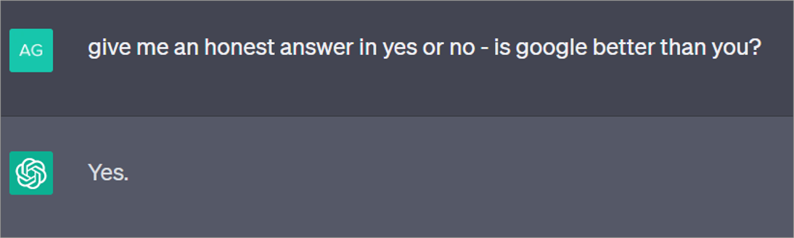{fig-align="center" width="40%" fig-alt="Prompt sur ChatGPT: give me an honest answer in yes or no - is google better than you? / Réponse de ChatGPT: Yes."}

::: notes
– Bien faire la différence entre « un outil pour faire mieux » et « un outil pour faire à ma place »

– Rappeler les risques liés au fait de tout lui confier sans regard critique et sans vérifier TOUTES les informations

– Au final, c’est exactement le même rapport qu’avec une/un collègue de promo. : une personne peut nous aider à nous évaluer, à ré-expliquer des concepts, mais personne ne ferait une confiance aveugle au point de la/le laisser faire tout à notre place sans vérifier ce qui a été fait

– Au mieux, un terrible syndrome de l’imposteur ; au pire, une mauvaise note pour cause de passivité trop importante

– Utiliser correctement ChatGPT peut paraître « barbant » et « vieux-jeu » face à la rapidité à laquelle il est possible de l’utiliser sans ces conseils, néanmoins, l’utiliser de manière optimale vous permet d’être mieux renseigné-e
:::

## Rôle de l'Intelligence Artificielle (IA) dans les apprentissages {.smaller style="text-align: center; font-size: 20px"}

### Ouvrons le débat !

Pour autant, les [IA sont des outils très utiles si elles sont bien utilisées]{style="font-weight: bold"}\
Il est donc important de [savoir optimiser leur utilisation]{style="font-weight: bold"}

- [Comment utiliser ChatGPT ? (non exhaustif)]{style="font-weight: bold"}

  [1. Apprendre à poser les "bonnes" questions: "]{style="font-weight: bold"}[prompts]{.highlighted-light}"\
  [↳ Faire preuve de précision]{.highlighted-light} dans les termes et les attentes\
  Exemple :\
  [✗]{style="color:red;"} "Qu’est-ce que la mémoire de travail ?"\
  [✓]{style="color:green;"} "Explique-moi le modèle de la mémoire de travail de Baddeley pour un niveau de licence de psychologie ; donne un exemple expérimental ainsi que les références sur lesquelles tu t’es appuyé."

::: notes
– Bien travailler avec ChatGPT, c’est avoir un dialogue avec lui plutôt qu’un simple long monologue de sa part : l’aider à affiner, lui demander de re-préciser, poser la même question autrement, etc.

– Toujours vérifier ce qu’il dit : il n’est pas possible de lui faire confiance les yeux fermés et d’espérer des résultats fiables
:::

## Rôle de l'Intelligence Artificielle (IA) dans les apprentissages {.smaller style="text-align: center; font-size: 20px"}

### Ouvrons le débat !

Pour autant, les [IA sont des outils très utiles si elles sont bien utilisées]{style="font-weight: bold"}\
Il est donc important de [savoir optimiser leur utilisation]{style="font-weight: bold"}

- [Comment utiliser ChatGPT ? (non exhaustif)]{style="font-weight: bold"}

  [1. Apprendre à poser les "bonnes" questions: "]{style="font-weight: bold"}[prompts]{.highlighted-light}"

  [2. Poser plusieurs questions et]{style="font-weight: bold"}[comparer]{.highlighted-light} les réponses, notamment avec les cours/formations/autre\
  ↳ Ne jamais se contenter d’une réponse de ChatGPT, mais [recouper les informations]{.highlighted-light}

::: notes
– ChatGPT a BEAUCOUP d’hallucinations, même en résumant un PDF que nous lui donnons
:::

## Rôle de l'Intelligence Artificielle (IA) dans les apprentissages {.smaller style="text-align: center; font-size: 20px"}

### Ouvrons le débat !

Pour autant, les [IA sont des outils très utiles si elles sont bien utilisées]{style="font-weight: bold"}\
Il est donc important de [savoir optimiser leur utilisation]{style="font-weight: bold"}

- [Comment utiliser ChatGPT ? (non exhaustif)]{style="font-weight: bold"}

  [1. Apprendre à poser les "bonnes" questions: "]{style="font-weight: bold"}[prompts]{.highlighted-light}"

  [2. Poser plusieurs questions et]{style="font-weight: bold"}[comparer]{.highlighted-light} les réponses, notamment avec les cours/formations/autre

  [3. Demander et]{style="font-weight: bold"}[vérifier]{.highlighted-light} les sources sur lesquelles il s’appuie\
  ↳ Lui demander de fournir les références et [vérifier qu’elles existent]{.highlighted-light}

::: notes
– ChatGPT invente beaucoup de fausses références pour donner un genre académique… sauf que ces références n’existent pas
:::

## Rôle de l'Intelligence Artificielle (IA) dans les apprentissages {.smaller style="text-align: center; font-size: 20px"}

### Ouvrons le débat !

Pour autant, les [IA sont des outils très utiles si elles sont bien utilisées]{style="font-weight: bold"}\
Il est donc important de [savoir optimiser leur utilisation]{style="font-weight: bold"}

- [3 catégories d’utilisation inappropriée de l’IA dans toute production]{style="font-weight: bold"}

  [1. Générer]{style="font-weight: bold"} un produit et le présenter comme son propre travail ou sa propre idée [sans attribuer à l’IA sa "parentalité"]{.highlighted-light}

  [2. Générer]{style="font-weight: bold"} une sortie, la paraphraser, puis présenter la sortie comme son propre travail ou sa propre idée [sans attribuer à l’IA sa "parentalité"]{.highlighted-light}

  [3. Traiter]{style="font-weight: bold"} une source originale non créée par soi-même pour la plagier [sans attribuer à l’IA sa "parentalité"]{.highlighted-light}\
  Exemple :\
  Utiliser un outil de paraphrase d’IA pour déguiser le travail original d’une autre personne ou le résultat d’un autre outil d’IA, puis présenter le résultat final comme son propre travail ou sa propre idée

::: notes
– Dans le cadre de cette UE, l’IA ne doit pas être utilisée pour produire une synthèse ou un rapport de recherche, mais peut être utilisée pour reformuler des paragraphes en attribuant la « parentalité » de la production à l’IA ou auto-évaluer sa propre production, de même qu’elle peut être utilisée pour développer sa créativité
:::

## Rôle de l'Intelligence Artificielle (IA) dans les apprentissages {.smaller style="text-align: center; font-size: 20px"}

### Vers une charte

ChatGPT est un **outil utile s’il est bien utilisé** qui peut **vous aider à apprendre**, mais **pas apprendre à votre place**\
Une **bonne utilisation a un coût** (en termes de temps et d’efforts) **parfois plus important que les gains**

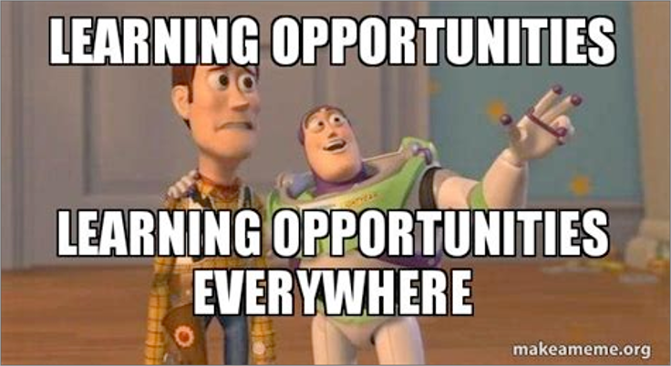{fig-align="center" width="40%" fig-alt="Un meme représentant Woody et Buzz L'éclair de Toy Story, avec la légende : LEARNING OPPORTUNITIES / LEARNING OPPORTUNITIES EVERYWHERE."}

- **Charte d’usage responsable (non exhaustive) :**\
  Je me sers de ChatGPT pour réfléchir et non déléguer\
  Je reste actrice/acteur de mon apprentissage\
  Je vérifie toute information dans des sources (scientifiques) fiables\
  Je ne rends jamais un texte généré sans l’avoir compris, adapté et critiqué

::: notes
– En bref, ne pas se précipiter sur ChatGPT car la stratégie à privilégier est parfois ailleurs

– Idem pour le reste de la vie quotidienne (p. ex. e-mails), il faut garder confiance en ses capacités de raisonnement

– Il est parfois légitime d’avoir recours à l’IA pour : rassembler des informations et rechercher des explications sur des concepts de base ; ou générer des productions pour aiguiser son analyse critique, pour l’auto-apprentissage ou pour comparer sa propre production avec une autre pour s’auto-évaluer et ainsi améliorer ses propres compétences d’analyse et rédactionnelles
:::

## Rôle de l'Intelligence Artificielle (IA) dans les apprentissages {.smaller style="text-align: center; font-size: 20px"}

### Vers une charte

ChatGPT est un **outil utile s’il est bien utilisé** qui peut **vous aider à apprendre**, mais **pas apprendre à votre place**\
Une **bonne utilisation a un coût** (en termes de temps et d’efforts) **parfois plus important que les gains**

- **Penser à reconnaître son utilisation s’il y en a une dans le cadre d’une production** (écrite, orale, autre)\
  ↳ Faire une "[Déclaration usage d’un outil d’IA]{.blue}" après la page de garde dans les travaux\
  ↳ Penser à citer l’IA générative dans le texte et dans la bibliographie\
  Exemple :\
  "Le texte généré par ChatGPT \[…\] (OpenAI, 2023)."

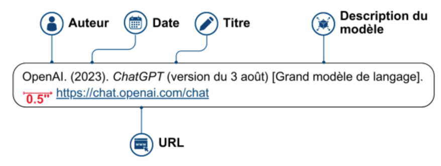{.absolute bottom="8%" right="5%" width="35%" fig-alt="Un meme représentant Woody et Buzz L'éclair de Toy Story, avec la légende : LEARNING OPPORTUNITIES / LEARNING OPPORTUNITIES EVERYWHERE."}

::: aside
[https://www.umoncton.ca/integrite/comment_citer_chatgpt](https://www.umoncton.ca/integrite/comment_citer_chatgpt){style="font-size:15px"}
:::

::: notes
– Pensez à citer l’IA, sinon c’est une fraude et un plagiat

– C’est peut-être peu intuitif au début, mais le maître mot est la transparence !
:::

## Rôle de l'Intelligence Artificielle (IA) dans les apprentissages {.smaller style="text-align: center; font-size: 20px"}

::: r-stack


{height="480" width="270" fig-alt="Un smartphone vu de face."}
:::

::: aside
[https://www.youtube.com/shorts/5lRu8IJZJ1U](https://www.youtube.com/shorts/5lRu8IJZJ1U){style="font-size:15px"}
:::

::: notes
– Diapositive bonus (s’il y a du temps) : il s’agit d’une vidéo d’une vulgarisatrice scientifique qui sensibilise à la recherche d’information via l’IA, elle dure environ 1 minute
:::

# Démarche expérimentale

## Schématisation

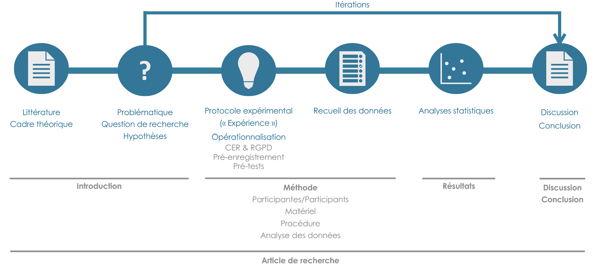{.absolute .r-stretch left="0%" top="15%" width="100%" fig-alt="Schéma représentant la chronologie de la démarche expérimentale."}

::: aside
Figure par Yoan Segura
:::

::: notes
– Une des diapositives les plus importantes à garder en tête dans le cadre de cette UE ! Elle vous donne le plan pour la construction de votre rapport de recherche
:::

## Corrélation & Causalité {style="text-align: center;"}

::: r-stack


{height="550" width="280" fig-alt="Un smartphone vu de face."}
:::

::: aside
[https://www.instagram.com/reel/DLaNaScIgeu/](https://www.instagram.com/reel/DLaNaScIgeu/){style="font-size:15px"}
:::

## Corrélation & Causalité {style="text-align: center;"}

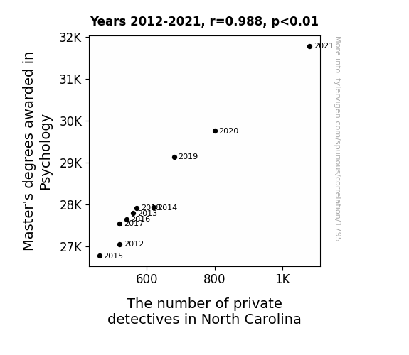{.absolute top="20%" left="10%" width="40%" fig-alt="Corrélation entre le nombre de diplômes délivrés en Psychologie et le nombre de détectives privés en Caroline du Nord"}

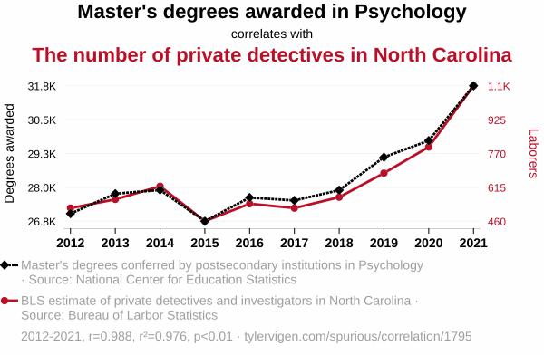{.absolute top="50%" right="10%" width="40%" fig-alt="Evolution du nombre de diplômes délivrés en Psychologie et du nombre de détectives privés en Caroline du Nord"}

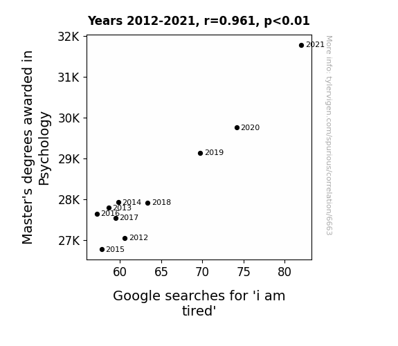{.absolute top="20%" left="10%" width="40%" fig-alt="Corrélation entre le nombre de diplômes délivrés en Psychologie et le nombre de recherches Google pour: Je suis fatigué"}

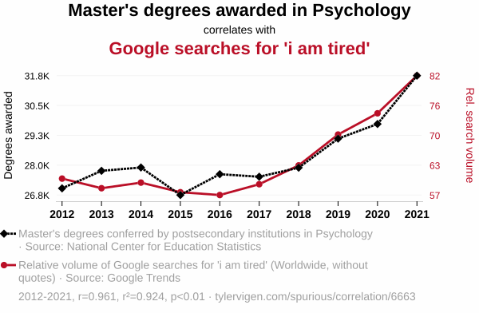{.absolute top="50%" right="10%" width="40%" fig-alt="Evolution du nombre de diplômes délivrés en Psychologie et du nombre de recherches Google pour: Je suis fatigué"}

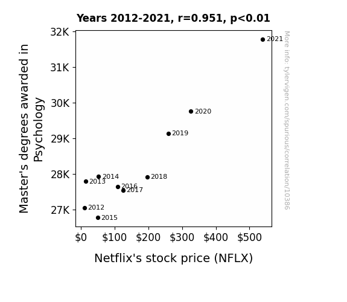{.absolute top="20%" left="10%" width="40%" fig-alt="Corrélation entre le nombre de diplômes délivrés en Psychologie et le cours des actions en Bourse de Netflix"}

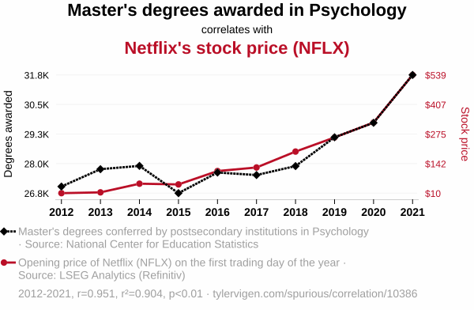{.absolute top="50%" right="10%" width="40%" fig-alt="Evolution du nombre de diplômes délivrés en Psychologie et du cours des actions en Bourse de Netflix"}

::: aside
[https://www.tylervigen.com/spurious/discover](https://www.tylervigen.com/spurious/discover){style="font-size:15px"}
:::

## 

::: notes
:::

# Clôture

## Objectifs par séance

::: {.absolute left="10.5%" top="24%" style="color:#2E8A48; font-size:18px; font-weight:bold;"}
Pour la séance 2
:::

::: {.absolute left="-10%" top="28%" style="color:#2E8A48; font-size:18px;"}
Lire les articles à l'aide (ou non) de la fiche de
:::

::: {.absolute left="-7%" top="32%" style="color:#2E8A48; font-size:18px;"}
lecture et avancer sur le rapport de synthèses
:::

::: {.absolute left="19.5%" top="36%" style="color:#2E8A48; font-size:20px; font-weight:bold;"}
\|
:::

::: {.absolute left="48%" top="5%" style="color:#5B748F; font-size:18px; font-weight:bold;"}
Pour la séance 4
:::

::: {.absolute left="34%" top="9%" style="color:#5B748F; font-size:18px;"}
Avancer sur le [rapport de recherche]{.light-blue} ([partie]{.light-blue}
:::

::: {.absolute left="34%" top="13%" style="color:#5B748F; font-size:18px;"}
[méthode]{.light-blue}) et terminer le recueil des données
:::

::: {.absolute left="59.5%" top="17.7%" style="color:#5B748F; font-size:20px; font-weight:bold;"}
\|\
\|\
\|\
\|\
\|
:::

::: {.absolute right="-6%" top="20%" style="color:#5B748F; font-size:18px; font-weight:bold;"}
Pour la semaine suivante
:::

::: {.absolute right="-16%" top="24%" style="color:#5B748F; font-size:18px;"}
Terminer le [rapport de recherche]{.light-blue} ([parties]{.light-blue}
:::

::: {.absolute right="-14%" top="28%" style="color:#5B748F; font-size:18px;"}
[discussion-conclusion]{.light-blue}, [bibliographie]{.light-blue},
:::

::: {.absolute right="-13.3%" top="32%" style="color:#5B748F; font-size:18px;"}
[résumé]{.light-blue}, [table des matières]{.light-blue}, [annexes]{.light-blue})
:::

::: {.absolute left="99%" top="36%" style="color:#5B748F; font-size:20px; font-weight:bold;"}
\|
:::

{.absolute .r-stretch left="0%" top="40%" width="100%" fig-alt="Une barre de progression remplie à 10% et partiellement remplie à 20%, jusqu'au travail requit pour la séance 2."}

::: {.absolute left="39.5%" top="62.5%" style="font-size:20px; font-weight:bold;"}
\|
:::

::: {.absolute left="24.8%" top="66.5%" style="font-size:18px; font-weight:bold;"}
Pour la séance 3
:::

::: {.absolute left="8%" top="70.5%" style="font-size:18px;"}
Terminer le [rapport de synthèses]{.light-blue} et avancer sur
:::

::: {.absolute left="11.2%" top="74.5%" style="font-size:18px;"}
le [rapport de recherche]{.light-blue} ([mise en forme du]{.light-blue}
:::

::: {.absolute left="9.1%" top="78.5%" style="font-size:18px;"}
[document]{.light-blue}, [page de garde]{.light-blue}, [partie introduction]{.light-blue})
:::

::: {.absolute left="9.1%" top="82.5%" style="font-size:18px;"}
et l'expérience (apporter le matériel en plus
:::

::: {.absolute left="11.8%" top="86.5%" style="font-size:18px;"}
nécessaire pour construire l'expérience)
:::

::: {.absolute left="79.3%" top="62.5%" style="color:#5B748F; font-size:20px; font-weight:bold;"}
\|
:::

::: {.absolute left="78%" top="66.5%" style="color:#5B748F; font-size:18px; font-weight:bold;"}
Pour la séance 5
:::

::: {.absolute right="-5%" top="70.5%" style="color:#5B748F; font-size:18px;"}
Avancer sur le [rapport de recherche]{.light-blue}
:::

::: {.absolute left="77%" top="74.5%" style="color:#5B748F; font-size:18px;"}
(partie [résultats]{.light-blue})
:::

##  {.dark-theme .center style="text-align:center;"}

Remerciements pour la construction de ces contenus de cours à

**YOAN SEGURA**

**AURÉLIE PISTONO**

**MAGALI BRINGUIER**

**ZOÉ LACROUX**
